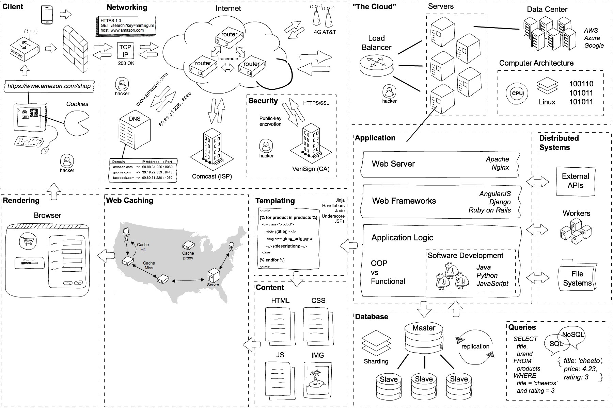

## [原文](https://www.zhihu.com/question/34873227)

# 在浏览器地址栏输入一个URL后回车，背后会进行哪些技术步骤？

## 客户端（当你点击按钮时发生了什么？）
 
## 计算机网络（信息是如何通过网络传播的？） 
 
## 网络安全（如何避免黑客盗取我们的密码？） 
 
## 服务器（“云端”到底是什么？） 
 
## 应用（Web服务器和Web框架到底是什么？） 
 
## 数据库（Web应用如何在数据库中检索数据？SQL vs NoSQL?） 
 
## 大规模（如何处理大规模请求） 
 
## 渲染（浏览器是如何工作的？

