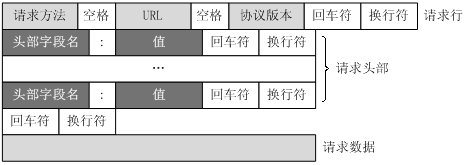

## [原文1](https://www.jianshu.com/p/283fd3db9fb2)
## [原文2](https://www.jianshu.com/p/8f61c95c078d)

# HTTP请求格式(HTTP请求报文)


## 一个HTTP请求报文由4部分组成：


- 请求行（request line）

- 请求头部（header）

- 空行

- 请求数据


下图给出了请求报文的一般格式。



HTTP请求报文图

## HTTP请求报文
```http request

GET / HTTP/1.1
Host: www.baidu.com
Connection: keep-alive
Upgrade-Insecure-Requests: 1
User-Agent: Mozilla/5.0 (Macintosh; Intel Mac OS X 10_11_6) AppleWebKit/537.36 (KHTML, like Gecko) Chrome/54.0.2840.71 Safari/537.36
Accept: text/html,application/xhtml+xml,application/xml;q=0.9,image/webp,*/*;q=0.8
Accept-Encoding: gzip, deflate, sdch
Accept-Language: zh-CN,zh;q=0.8,en;q=0.6
Cookie: BAIDUID=4082549DEE5E64678FC46642E185D98C:FG=1; BIDUPSID=4082549DEE5E64678FC46642E185D98C; PSTM=1472215668; MCITY=-%3A; BDSFRCVID=pSFsJeCCxG3C4A5iySIze8tzxQmzvLxREDct3J; H_BDCLCKID_SF=tR38LRu8KJjEe-Kk-PnVeUFLQlbZKxJmMgkeWlbMQnTR85CGXUQVWx4_Qb6gXU-L5nT9bDOFfDL2bKKmjTL3K4LOMq5-5b0X-K5L3JD8bnjoHRjvq4bohjPy5G7eBtQm05bxohOIHRoE8M0m2ROkMtutKJjQW-nQ5HbbhCLbWDF5MIDGj50WenLHMfnXetJQ2C7WsJceHJOoDDvx0Uj5y4LdLp7xJMtJ0RT0XxOYMJKWf-c90tc05xAb04oR5b0eWJQ2QJ8BtCtKhD3P; pgv_pvi=7232093184; pgv_si=s9982430208; BDRCVFR[IzI_eUGSZP3]=mbxnW11j9Dfmh7GuZR8mvqV; BD_CK_SAM=1; PSINO=5; BD_HOME=0; H_PS_PSSID=1421_17946_21125_18559_21455_21419_21394_21378_21191_21398; BD_UPN=123253; BD_LAST_QID=17716714193052416912

```
解释：

- GET / HTTP/1.1，请求起始行

- GET，请求方法

- /，请求URL，命名了所请求资源,或者URL路径组件的完整URL。如果直接与服务器进行对话,
只要URL的路径组件是资源的绝对路径,通常就不会有什么问题——服务器可以假定自己是URL的主机/端口。

- HTTP/1.1，请求采用的协议及版本号

- Host，请求的服务器

- Connection，连接方式

- Upgrade-Insecure-Requests，

- User-Agent，将发起请求的应用程序名称告知服务器

- Accept，请求首部，是请求报文特有的。它们为服务器提供了一些额外信息,比如客户端希望接收什么类型的数据。例子中接收html，xhtml，xml等数据。

- Accept-Encoding，告诉服务器能够发送哪些编码方式

- Accept-Language，告诉服务器能够发送哪些语言

- Cookie，Cookie信息，客户端用它向服务器传送一个令牌——它并不是真正的安全首部,但确实隐含了安全功能

 


## 1、请求行
请求行包括：请求方法字段、URL字段、HTTP协议版本字段。它们用空格分隔。

> 例如，GET /index.html HTTP/1.1。

HTTP协议的请求方法包括：GET、POST、HEAD、PUT、DELETE、OPTIONS、TRACE、CONNECT。

而常见的有如下几种：

- 1). GET

最常见的一种请求方式，当客户端要从服务器中读取文档时，
当点击网页上的链接或者通过在浏览器的地址栏输入网址来浏览网页的，使用的都是GET方式。

GET方法要求服务器将URL定位的资源放在响应报文的数据部分，回送给客户端。
使用GET方法时，请求参数和对应的值附加在URL后面，利用一个问号（"?"）代表URL的结尾与请求参数的开始，
传递参数长度受限制。例如，/index.jsp?id=100&op=bind，这样通过GET方式传递的数据直接表示在地址中。
显然，这种方式不适合传送私密数据。

另外，由于不同的浏览器对地址的字符限制也有所不同，一般最多只能识别1024个字符，
所以如果需要传送大量数据的时候，也不适合使用GET方式。

以用google搜索domety为例，Request格式如下：
```http request
GET /search?hl=zh-CN&source=hp&q=domety&aq=f&oq= HTTP/1.1  
Accept: image/gif, image/x-xbitmap, image/jpeg, image/pjpeg, application/vnd.ms-excel, application/vnd.ms-powerpoint, 
application/msword, application/x-silverlight, application/x-shockwave-flash, */*  
Referer: http://www.google.cn/ 
Accept-Language: zh-cn  
Accept-Encoding: gzip, deflate  
User-Agent: Mozilla/4.0 (compatible; MSIE 6.0; Windows NT 5.1; SV1; .NET CLR 2.0.50727; TheWorld)  
Host: www.google.cn  
Connection: Keep-Alive  
Cookie: PREF=ID=80a06da87be9ae3c:U=f7167333e2c3b714:NW=1:TM=1261551909:LM=1261551917:S=ybYcq2wpfefs4V9g; 
NID=31=ojj8d-IygaEtSxLgaJmqSjVhCspkviJrB6omjamNrSm8lZhKy_yMfO2M4QMRKcH1g0iQv9u-2hfBW7bUFwVh7pGaRUb0RnHcJU37y-
FxlRugatx63JLv7CWMD6UB_O_r

```

- 2). POST

对于上面提到的不适合使用GET方式的情况，可以考虑使用POST方式，
因为使用POST方法可以允许客户端给服务器提供信息较多。

POST方法将请求参数封装在HTTP请求数据中，以名称/值的形式出现，可以传输大量数据，
这样POST方式对传送的数据大小没有限制，而且也不会显示在URL中。

POST方式大多用于页面的表单中。
还以上面的搜索domety为例，如果使用POST方式的话，格式如下：

```http request
POST /search HTTP/1.1  
Accept: image/gif, image/x-xbitmap, image/jpeg, image/pjpeg, application/vnd.ms-excel, application/vnd.ms-powerpoint, 
application/msword, application/x-silverlight, application/x-shockwave-flash, */*  
Referer: http://www.google.cn/
Accept-Language: zh-cn  
Accept-Encoding: gzip, deflate  
User-Agent: Mozilla/4.0 (compatible; MSIE 6.0; Windows NT 5.1; SV1; .NET CLR 2.0.50727; TheWorld)  
Host: www.google.cn 
Connection: Keep-Alive  
Cookie: PREF=ID=80a06da87be9ae3c:U=f7167333e2c3b714:NW=1:TM=1261551909:LM=1261551917:S=ybYcq2wpfefs4V9g; 
NID=31=ojj8d-IygaEtSxLgaJmqSjVhCspkviJrB6omjamNrSm8lZhKy_yMfO2M4QMRKcH1g0iQv9u-2hfBW7bUFwVh7pGaRUb0RnHcJU37y-
FxlRugatx63JLv7CWMD6UB_O_r  

hl=zh-CN&source=hp&q=domety

```

- 3). HEAD

HEAD就像GET，只不过服务端接受到HEAD请求后只返回响应头，而不会发送响应内容。
当我们只需要查看某个页面的状态的时候，使用HEAD是非常高效的，因为在传输的过程中省去了页面内容。

## 2、请求头部
请求头部由关键字/值对组成，每行一对，关键字和值用英文冒号“:”分隔。
请求头部通知服务器有关于客户端请求的信息，典型的请求头有：

- User-Agent：产生请求的浏览器类型。

- Accept：客户端可识别的内容类型列表。

- Host：请求的主机名，允许多个域名同处一个IP地址，即虚拟主机。

## 3、空行
最后一个请求头之后是一个空行，发送回车符和换行符，通知服务器以下不再有请求头。

## 4、请求数据
请求数据不在GET方法中使用，而是在POST方法中使用。POST方法适用于需要客户填写表单的场合。
与请求数据相关的最常使用的请求头是Content-Type和Content-Length。

 