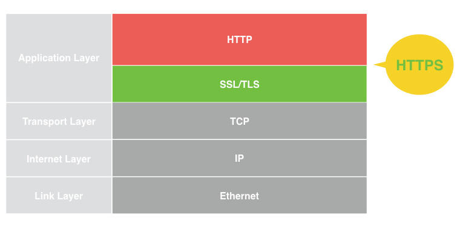
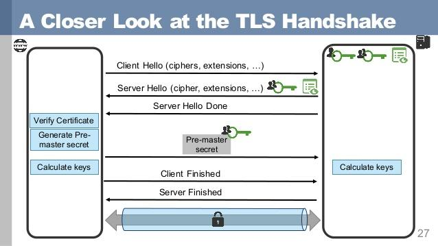
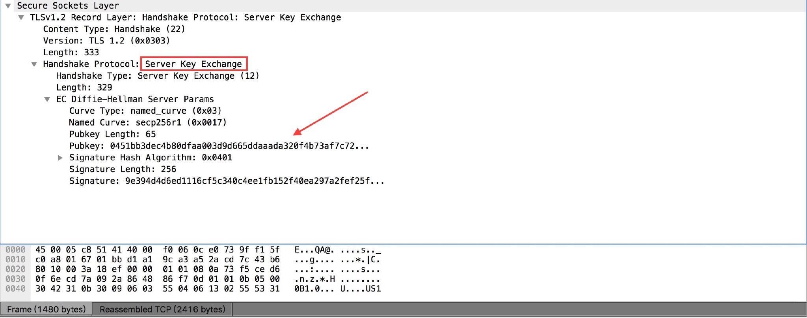
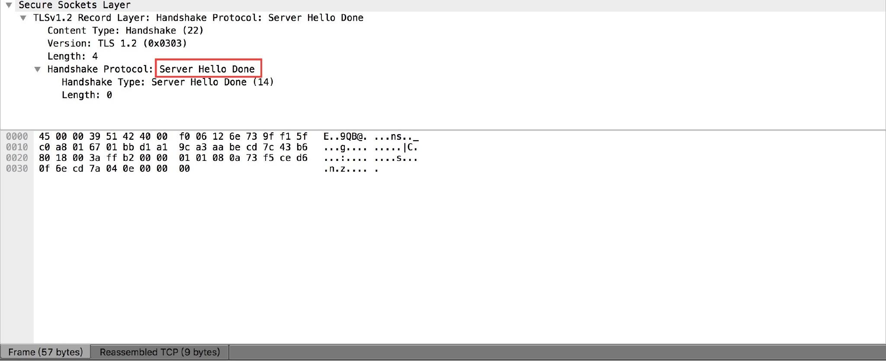
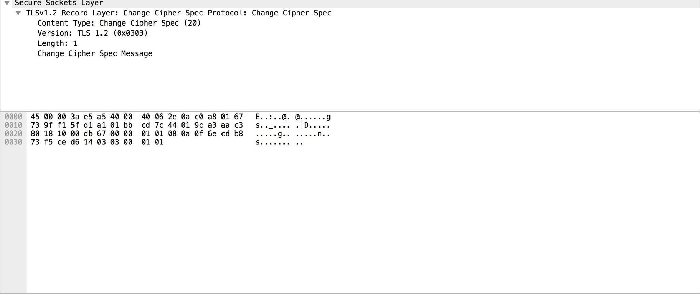
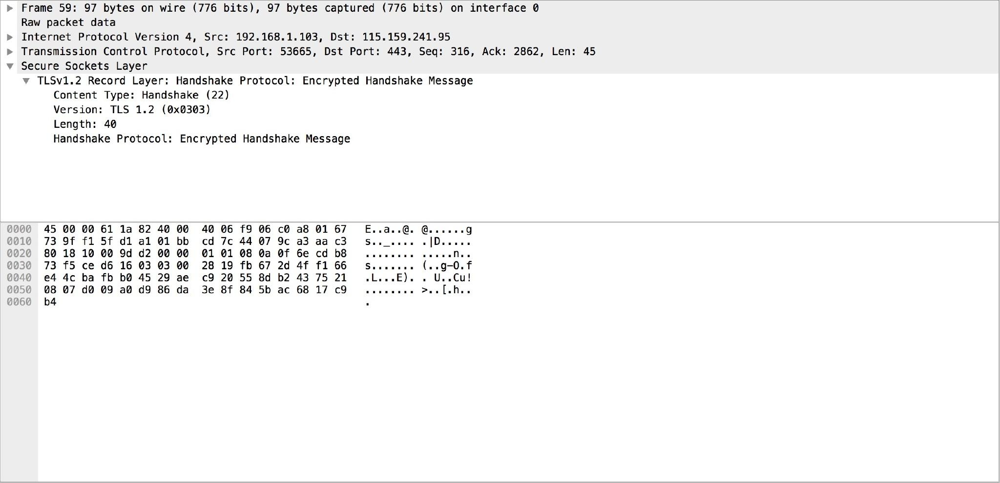
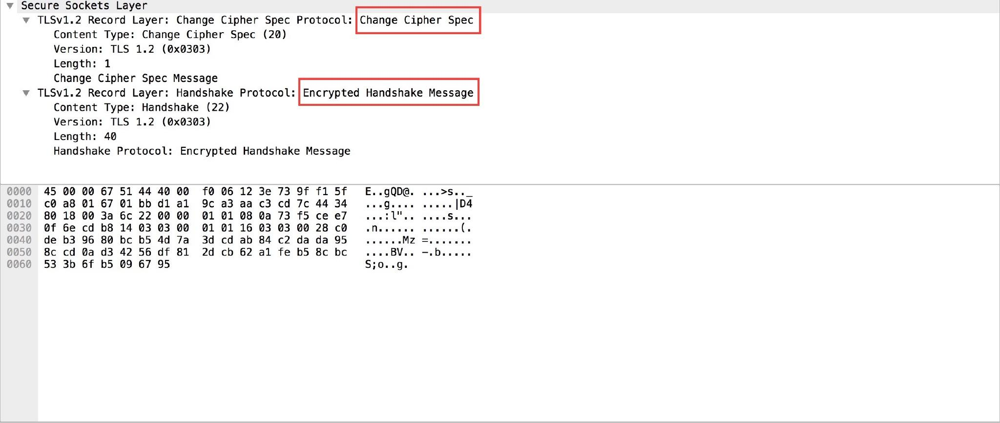
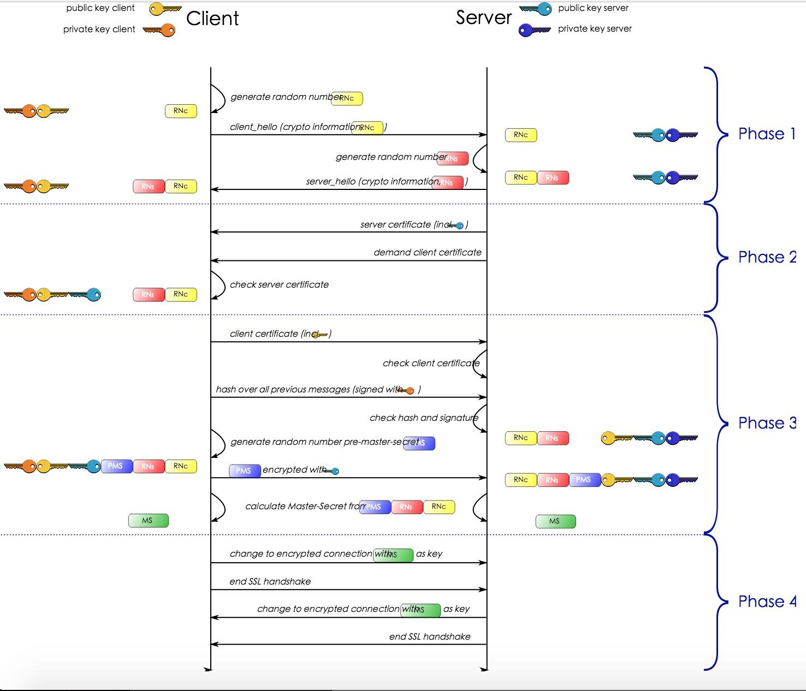
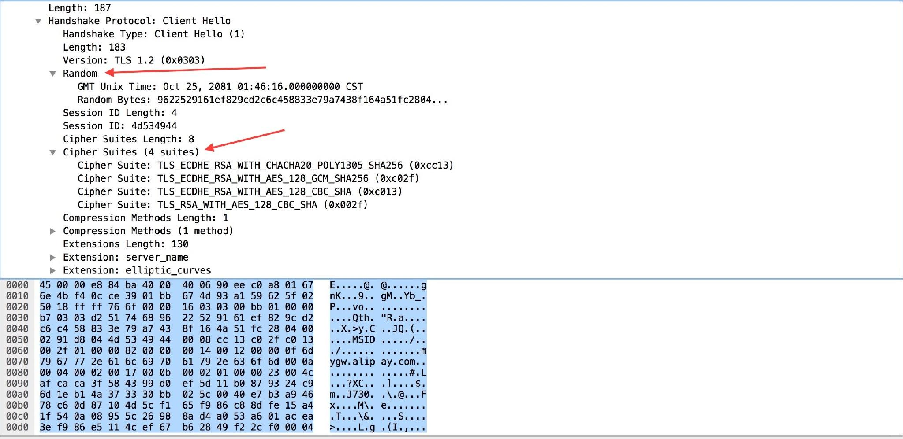

## [原文](https://www.jianshu.com/p/7158568e4867)

# SSL/TLS 握手过程详解

我们知道，HTTP 协议都是明文传输内容，在早期只展示静态内容时没有问题。
伴随着互联网的快速发展，人们对于网络传输安全性的要求也越来越高，HTTPS 协议因此出现。

如上图所示，在 HTTPS 加密中真正起作用的其实是 SSL/TLS 协议。
SSL/TLS 协议作用在 HTTP 协议之下，对于上层应用来说，原来的发送接收数据流程不变，
这就很好地兼容了老的 HTTP 协议，这也是软件开发中分层实现的体现。

SSL/TLS 握手是为了安全地协商出一份对称加密的秘钥，这个过程很有意思，下面我们一起来了解一下。

> 以下内容需要你对加解密、数字签名和数字证书的概念有一定了解，
这里[有一篇文章](https://www.jianshu.com/p/ffe8c203a471)可以帮你快速了解这几个概念。

## SSL/TLS 握手过程

 
上图大致描述了 SSL/TLS 的握手过程，但缺少了一些信息不利于理解，我会在后面的讲解里再列出来。

### Client Hello

握手第一步是客户端向服务端发送 Client Hello 消息，
这个消息里包含了一个客户端生成的随机数 Random1、客户端支持的加密套件（Support Ciphers）和 SSL Version 等信息。
通过 Wireshark 抓包，我们可以看到如下信息：

> Wireshark 抓包的用法可以参考[这篇文章](https://www.jianshu.com/p/c67baf5fce6d)

### Server Hello

第二步是服务端向客户端发送 Server Hello 消息，
这个消息会从 Client Hello 传过来的 Support Ciphers 里确定一份加密套件，
这个套件决定了后续加密和生成摘要时具体使用哪些算法，另外还会生成一份随机数 Random2。
注意，至此客户端和服务端都拥有了两个随机数（Random1+ Random2），这两个随机数会在后续生成对称秘钥时用到。

 
### Certificate
这一步是服务端将自己的证书下发给客户端，让客户端验证自己的身份，客户端验证通过后取出证书中的公钥。
 

### Server Key Exchange
如果是DH算法，这里发送服务器使用的DH参数。RSA算法不需要这一步。

### Certificate Request

Certificate Request 是服务端要求客户端上报证书，这一步是可选的，对于安全性要求高的场景会用到。

### Server Hello Done
Server Hello Done 通知客户端 Server Hello 过程结束。

 

### Certificate Verify

客户端收到服务端传来的证书后，先从 CA 验证该证书的合法性，
验证通过后取出证书中的服务端公钥，再生成一个随机数 Random3，
再用服务端公钥非对称加密 Random3 生成 PreMaster Key。

### Client Key Exchange
上面客户端根据服务器传来的公钥生成了 PreMaster Key，Client Key Exchange 就是将这个 key 传给服务端，
服务端再用自己的私钥解出这个 PreMaster Key 得到客户端生成的 Random3。

至此，客户端和服务端都拥有 Random1 + Random2 + Random3，两边再根据同样的算法就可以生成一份秘钥，
握手结束后的应用层数据都是使用这个秘钥进行对称加密。

为什么要使用三个随机数呢？   
这是因为 SSL/TLS 握手过程的数据都是明文传输的，并且多个随机数种子来生成秘钥不容易被暴力破解出来。
客户端将 PreMaster Key 传给服务端的过程如下图所示：

### Change Cipher Spec(Client)
这一步是客户端通知服务端后面再发送的消息都会使用前面协商出来的秘钥加密了，是一条事件消息。

### Encrypted Handshake Message(Client)
这一步对应的是 Client Finish 消息，客户端将前面的握手消息生成摘要再用协商好的秘钥加密，
这是客户端发出的第一条加密消息。服务端接收后会用秘钥解密，能解出来说明前面协商出来的秘钥是一致的。

### Change Cipher Spec(Server)
这一步是服务端通知客户端后面再发送的消息都会使用加密，也是一条事件消息。

### Encrypted Handshake Message(Server)
这一步对应的是 Server Finish 消息，服务端也会将握手过程的消息生成摘要再用秘钥加密，
这是服务端发出的第一条加密消息。客户端接收后会用秘钥解密，能解出来说明协商的秘钥是一致的。

### Application Data
到这里，双方已安全地协商出了同一份秘钥，所有的应用层数据都会用这个秘钥加密后再通过 TCP 进行可靠传输。

### 双向验证
前面提到 Certificate Request 是可选的，下面这张图展示了双向验证的过程：

 

### 握手过程优化
如果每次重连都要重新握手还是比较耗时的，所以可以对握手过程进行优化。
从下图里我们看到 Client Hello 消息里还附带了上一次的 Session ID，
服务端接收到这个 Session ID 后如果能复用就不再进行后续的握手过程。

除了上述的 Session 复用，SSL/TLS 握手还有一些优化技术，例如 False Start、Session Ticket 等，
这方面的介绍具体可以参考这篇文章。

### 总结
前面我们一起详细地了解了整个 SSL/TLS 的握手过程，这部分知识在平时的开发过程中很少用到，
但能让我们更清楚地了解 HTTPS 的工作原理，而不仅仅是只知道 HTTPS 会加密数据十分安全。
同时这个过程也是各种加密技术的一个经典运用，也能帮助我们加深加密相关技术的理解。
最后，建议大家也用 Wireshark 实际抓包体验一下这个过程来加深印象，enjoy~

### 参考资料

<http://www.ruanyifeng.com/blog/2014/02/ssl_tls.html>

<https://segmentfault.com/a/1190000002554673>

<https://imququ.com/post/optimize-tls-handshake.html>

<http://blog.csdn.net/fw0124/article/details/40983787>

 