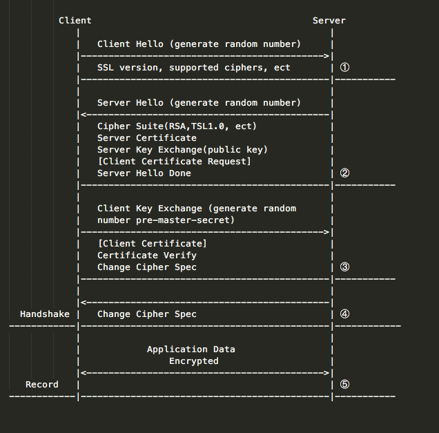

## [原文](https://www.jianshu.com/p/c93612b3abac)

# SSL/TLS协议

> "握手阶段"（handshake）

## SSL/TLS协议概览

### SSL/TLS协议是什么

计算机网络的OSI七层模型和TCP/IP四层模型想必大家都知道。
其中SSL/TLS是一种介与于传输层（比如TCP/IP）和应用层（比如HTTP）的协议。

它通过"握手协议(Handshake Protocol)"和"传输协议(Record Protocol)"来解决传输安全的问题。

SSL/TLS是一个可选层，没有它，使用HTTP也可以通信，它存在的目的就是为了解决安全问题，这也就是HTTPS相对于HTTP的精髓所在。
 
 
### [SSL/TLS协议发展历史](https://zh.wikipedia.org/wiki/%E5%82%B3%E8%BC%B8%E5%B1%A4%E5%AE%89%E5%85%A8%E5%8D%94%E8%AD%B0#.E7.99.BC.E5.B1.95.E6.AD.B7.E5.8F.B2)

## SSL/TLS运行过程

### SSL/TLS运行过程概述

上面提到SSL/TLS有两个阶段握手协议和传输协议，握手协议就是建立起连接的过程，这个阶段采用非对称加密，
这个过程完毕后会生成一个对话秘钥，从而传输协议过程，就是用这个对话秘钥使用对称加密进行传输。
之所以这样做，是因为，非对称加密是很耗性能的。而握手协议过程中，使用数字证书保证了公钥的安全性。

当然这个过程既可以双向证书验证，也可以只验证服务端的证书单向证书验证。这也是前两节所作的铺垫，不至于这儿看的太迷糊。

## SSL/TLS运行过程详解

SSL/TLS运行过程详解

结合上图 我来说明上图中一步步的都发生了什么？

### 客户端发出请求(Client Hello)
对应上图第一步，客户端发出请求，这一步客户端主要向服务端提供以下信息：

- 支持的SSL/TLS协议版本

- 支持的加密套件列表(cipher suite)

- 支持的压缩算法列表(compression methods)，用于后续的压缩传输

- 产生的一个随机数random_C(random number)，客户端有存留，稍后用于生成"对话密钥(session key)"

### 服务端回应(Server Hello)

- 收到客服端的请求之后，服务端向客户端回应以下信息：

- 根据客户端支持的SSL/TLS协议版本，和自己的比较确定使用的SSL/TLS协议版本，如果没有合适的，对话关闭

- 回应加密套件，压缩算法

- 产生的一个随机数random_S(random number)，服务端有存留，稍后用于生成"对话密钥(session key)"

- 服务端数字证书(证明自己的身份，传递公钥)

- 如果需要验证客户端，发出请求，要求客户端提供证书

### 客户端回应

客户端收到服务端的回应后，首先验证服务端的数字证书，如果证书没有问题继续下去，如果证书有问题，
则会有相应提示，或者对话直接关闭。然后客户端在向服务端发送以下信息：

- 如果服务端有请求证书，发送自己的数字证书

- 在产生一个随机数pre-master key(random number)，并且用服务端数字证书中的公钥加密

- 编码改变通知，表示随后的信息都将用双方商定的加密方法和密钥发送

### 服务端最后的回应
如果有客户端的证书，就先验证客户端的证书

- 使用自己的私钥，对随机数pre-master key解密，这时客户端和服务端各自有了三个随机数，
然后用原来协商的加密方式生成本次通话使用的会话密钥(session key)

- 编码改变通知，表示随后的信息都将用双方商定的加密方法和密钥发送

这时客户端和服务端都有了session key，然后握手协议阶段就结束了。
下面开始使用session key对称加密数据，进行传输，就进入了下一个阶段，传输协议过程。

### 总结
这块的重点在与SSL/TSL协议的握手协议过程。在第三步，客户端验证证书的时候，
如果服务端的证书在系统默认信任证书列表中(系统会默认信任一些CA认证中心的根证书)则会直接通过，
如果没有在系统默认信任证书列表中，浏览器可能会弹窗让用户选择是否信任该证书，
也有可能会直接关闭连接，提示用户，证书不可信。而在App内，如果想要信任未在系统信任列表中的证书，
则需要在App内提前置入服务端证书，关于这一点有讲。而关于认证方式，大多数也都是采用的单向认证，
也就是说仅仅认证服务端的证书，而像银行等机构则多使用双向认证的方式。

## 参考

SSL/TLS协议运行机制的概述

 