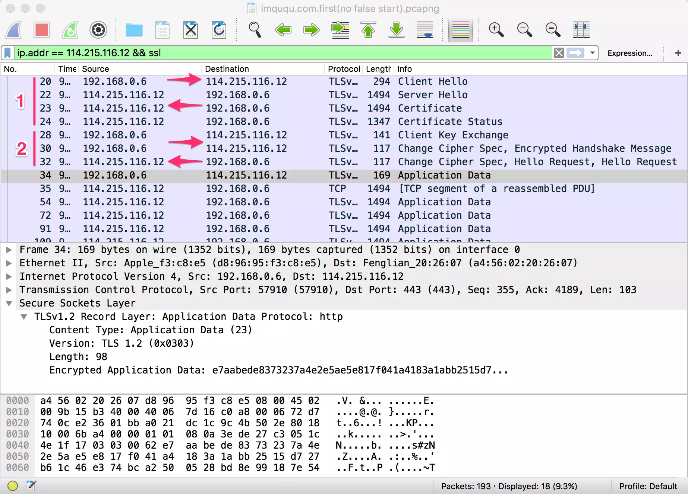

## [原文](https://imququ.com/post/optimize-tls-handshake.html)

# TLS 握手优化详解

## TLS 握手
   在传输应用数据之前，客户端必须与服务端协商密钥、加密算法等信息，服务端还要把自己的证书发给客户端表明其身份，
   这些环节构成 TLS 握手过程，如下图所示：
   
   
   
可以看到，假设服务端和客户端之间单次传输耗时 28ms，那么客户端需要等到 168ms 之后才能开始发送 HTTP 请求报文，
这还没把客户端和服务端处理时间算进去。光是 TLS 握手就需要消耗两个 RTT（Round-Trip Time，往返时间），
这就是造成 HTTPS 更慢的主要原因。当然，HTTPS 要求数据加密传输，
加解密相比 HTTP 也会带来额外的开销，不过对称加密本来就很快，加上硬件性能越来越好，所以这部分开销还好。

详细的 TLS 握手过程这里就不介绍了，大家可以通过这两篇文章去了解：

[大型网站的 HTTPS 实践（一）—— HTTPS 协议和原理]()

[Keyless SSL: The Nitty Gritty Technical Details]()

通过 Wireshark 抓包可以清楚地看到完整 TLS 握手过程所需的两个 RTT，如下图：

## False Start
 False Start 有抢跑的意思，意味着不按规则行事。
 TLS False Start 是指客户端在发送 Change Cipher Spec Finished 同时发送应用数据（如 HTTP 请求），
 服务端在 TLS 握手完成时直接返回应用数据（如 HTTP 响应）
   
   
   
## Session Resumption
   另外一个提高 TLS 握手效率的机制是会话复用。会话复用的原理很简单，将第一次握手辛辛苦苦算出来的对称密钥存起来，后续请求中直接使用。
   这样可以节省证书传送等开销，也可以将 TLS 握手所需 RTT 减少到一个 
     
     
     
### Session Identifier
  Session Identifier（会话标识符），是 TLS 握手中生成的 Session ID。
  服务端可以将 Session ID 协商后的信息存起来，浏览器也可以保存 Session ID，并在后续的 ClientHello 握手中带上它，
  如果服务端能找到与之匹配的信息，就可以完成一次快速握手。
     
### Session Ticket
  Session Identifier 机制有一些弊端，例如：1）负载均衡中，多机之间往往没有同步 Session 信息，
  如果客户端两次请求没有落在同一台机器上就无法找到匹配的信息；2）服务端存储 Session ID 对应的信息不好控制失效时间，
  太短起不到作用，太长又占用服务端大量资源。
  
  而 Session Ticket（会话记录单）可以解决这些问题，Session Ticket 是用只有服务端知道的安全密钥加密过的会话信息，
  最终保存在浏览器端。浏览器如果在 ClientHello 时带上了 Session Ticket，只要服务器能成功解密就可以完成快速握手