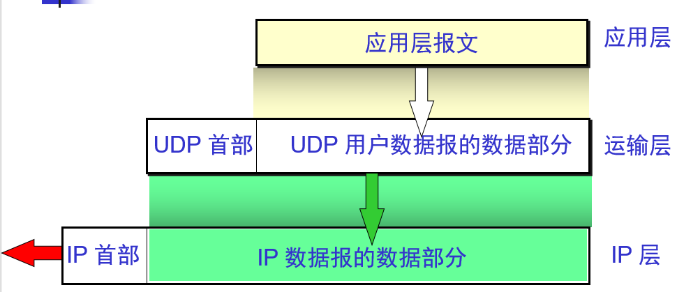
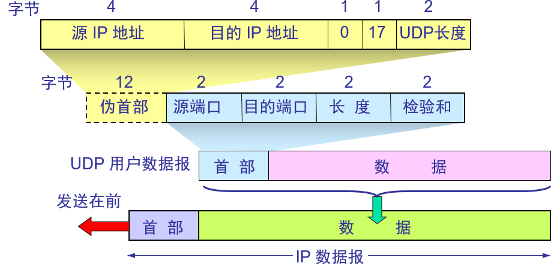

## [原文1](https://www.jianshu.com/p/335de1323ce9)

## [原文2](https://blog.csdn.net/goodboy1881/article/details/713856 )

# 通信原理之UDP协议

## 1.UDP简要介绍
UDP是传输层协议，和TCP协议处于一个分层中，但是与TCP协议不同，UDP协议并不提供超时重传，出错重传等功能，也就是说其是不可靠的协议。

### 1.UDP概述
- UDP 只在 IP 的数据报服务之上增加了很少一点的功能，即端口的功能和差错检测的功能。

- 虽然 UDP 用户数据报只能提供不可靠的交付，但 UDP 在某些方面有其特殊的优点。

UDP的主要特点：

- UDP 是无连接的，即发送数据之前不需要建立连接。
- UDP 使用尽最大努力交付，即不保证可靠交付，同时也不使用拥塞控制。
- UDP 是面向报文的。UDP 没有拥塞控制，很适合多媒体通信的要求。
- UDP 支持一对一、一对多、多对一和多对多的交互通信。
- UDP 的首部开销小，只有 8 个字节。

面向报文的UDP：

- 发送方 UDP 对应用程序交下来的报文，在添加首部后就向下交付 IP 层。
UDP 对应用层交下来的报文，既不合并，也不拆分，而是保留这些报文的边界。

- 应用层交给 UDP 多长的报文，UDP 就照样发送，即一次发送一个报文。

- 接收方 UDP 对 IP 层交上来的 UDP 用户数据报，在去除首部后就原封不动地交付上层的应用进程，一次交付一个完整的报文。

- 应用程序必须选择合适大小的报文

- 用户数据报 UDP 有两个字段：数据字段和首部字段。首部字段有 8 个字节，由 4 个字段组成，每个字段都是两个字节。

- 在计算检验和时，临时把“伪首部”和 UDP 用户数据报连接在一起。伪首部仅仅是为了计算检验和。

 
## 2.UDP协议头

### 2.1.UDP端口号
由于很多软件需要用到UDP协议，所以UDP协议必须通过某个标志用以区分不同的程序所需要的数据包。
端口号的功能就在于此，例如某一个UDP程序A在系统中注册了3000端口，
那么，以后从外面传进来的目的端口号为3000的UDP包都会交给该程序。
端口号理论上可以有2^16这么多。因为它的长度是16个bit

### 2.2.UDP检验和
这是一个可选的选项，并不是所有的系统都对UDP数据包加以检验和数据(相对TCP协议的必须来说)，
但是RFC中标准要求，发送端应该计算检验和。

UDP检验和覆盖UDP协议头和数据，这和IP的检验和是不同的，IP协议的检验和只是覆盖IP数据头，并不覆盖所有的数据。
UDP和TCP都包含一个伪首部，这是为了计算检验和而摄制的。
伪首部甚至还包含IP地址这样的IP协议里面都有的信息，目的是让UDP两次检查数据是否已经正确到达目的地。
如果发送端没有打开检验和选项，而接收端计算检验和有差错，那么UDP数据将会被悄悄的丢掉（不保证送达），而不产生任何差错报文。

### 2.3.UDP长度
UDP可以很长很长，可以有65535字节那么长。
但是一般网络在传送的时候，一次一般传送不了那么长的协议（涉及到MTU的问题），就只好对数据分片，
当然，这些是对UDP等上级协议透明的，UDP不需要关心IP协议层对数据如何分片，下一个章节将会稍微讨论一些分片的策略。

## 3.IP分片
IP在从上层接到数据以后，要根据IP地址来判断从那个接口发送数据（通过选路），并进行MTU的查询，
如果数据大小超过MTU就进行数据分片。
数据的分片是对上层和下层透明，而数据也只是到达目的地还会被重新组装，不过不用担心，IP层提供了足够的信息进行数据的再组装。

在IP头里面，16bit识别号唯一记录了一个IP包的ID,具有同一个ID的IP片将会被重新组装；
而13位片偏移则记录了某IP片相对整个包的位置；
而这两个表示中间的3bit标志则标示着该分片后面是否还有新的分片。
这三个标示就组成了IP分片的所有信息，
接受方就可以利用这些信息对IP数据进行重新组织（就算是后面的分片比前面的分片先到，这些信息也是足够了）。

因为分片技术在网络上被经常的使用，所以伪造IP分片包进行流氓攻击的软件和人也就层出不穷。

可以用Trancdroute程序来进行简单的MTU侦测。请参看教材。

## 4.UDP和ARP之间的交互式用
这是不常被人注意到的一个细节，这是针对一些系统地实现来说的。
当ARP缓存还是空的时候。UDP在被发送之前一定要发送一个ARP请求来获得目的主机的MAC地址，
如果这个UDP的数据包足够大，大到IP层一定要对其进行分片的时候，想象中，
该UDP数据包的第一个分片会发出一个ARP查询请求，所有的分片都辉等到这个查询完成以后再发送。事实上是这样吗？

结果是，某些系统会让每一个分片都发送一个ARP查询，所有的分片都在等待，
但是接受到第一个回应的时候，主机却只发送了最后一个数据片而抛弃了其他，这实在是让人匪夷所思。
这样，因为分片的数据不能被及时组装，接受主机将会在一段时间内将永远无法组装的IP数据包抛弃，
并且发送组装超时的ICMP报文（其实很多系统不产生这个差错），以保证接受主机自己的接收端缓存不被那些永远得不到组装的分片充满。

## 5.ICMP源站抑制差错
当目标主机的处理速度赶不上数据接收的速度，因为接受主机的IP层缓存会被占满，所以主机就会发出一个“我受不了”的一个ICMP报文。

## 6.UDP服务器设计
UDP协议的某些特性将会影响我们的服务器程序设计，大致总结如下：

- 关于客户IP和地址：服务器必须有根据客户IP地址和端口号判断数据包是否合法的能力（这似乎要求每一个服务器都要具备）

- 关于目的地址：服务器必须要有过滤广播地址的能力。

- 关于数据输入：通常服务器系统的每一个端口号都会和一块输入缓冲区对应，
进来的输入根据先来后到的原则等待服务器的处理，所以难免会出现缓冲区溢出的问题，
这种情况下，UDP数据包可能会被丢弃，而应用服务器程序本身并不知道这个问题。

- 服务器应该限制本地IP地址，就是说它应该可以把自己绑定到某一个网络接口的某一个端口上。
 