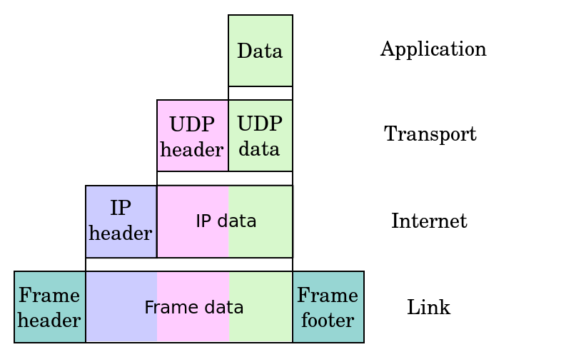

## [原文](https://zh.wikipedia.org/wiki/TCP/IP%E5%8D%8F%E8%AE%AE%E6%97%8F)

# TCP/IP协议族

互联网协议（英语：Internet Protocol Suite，缩写IPS）是一个网络通信模型，以及一整个网络传输协议家族，为互联网的基础通信架构。
它常被通称为TCP/IP协议族（英语：TCP/IP Protocol Suite，或TCP/IP Protocols），简称TCP/IP。

因为该协议家族的两个核心协议：TCP（传输控制协议）和IP（网际协议），为该家族中最早通过的标准。

由于在网络通讯协议普遍采用分层的结构，当多个层次的协议共同工作时，类似计算机科学中的堆栈，
因此又被称为TCP/IP协议栈（英语：TCP/IP Protocol Stack 。

这些协议最早发源于美国国防部（缩写为DoD）的ARPA网项目，因此也被称作DoD模型（DoD Model）。
这个协议族由互联网工程任务组负责维护。

TCP/IP提供点对点的链接机制，将数据应该如何封装、定址、传输、路由以及在目的地如何接收，都加以标准化。
它将软件通信过程抽象化为四个抽象层，采取协议堆栈的方式，分别实现出不同通信协议。
协议族下的各种协议，依其功能不同，被分别归属到这四个层次结构之中，常被视为是简化的七层OSI模型。

## TCP/IP参考模型

TCP/IP参考模型是一个抽象的分层模型，这个模型中，
所有的TCP/IP系列网络协议都被归类到4个抽象的"层"中。
每一抽象层创建在低一层提供的服务上，并且为高一层提供服务。 
完成一些特定的任务需要众多的协议协同工作，这些协议分布在参考模型的不同层中的，
因此有时称它们为一个协议栈。

两个因特网主机通过两个路由器和对应的层连接。
各主机上的应用通过一些数据信道相互执行读取操作

 
RFC 1122中描述的沿着不同的层应用数据的封装递减

### 因特网协议栈中的层

人们已经进行一些讨论关于如何将TCP/IP参考模型映射到OSI模型。
由于TCP/IP和OSI模型组不能精确地匹配，还没有一个完全正确的答案。 

另外，OSI模型下层还不具备能够真正占据真正层的位置的能力；
在传输层和网络层之间还需要另外一个层（网络互连层）。
特定网络类型专用的一些协议应该运行在网络层上，但是却运行在基本的硬件帧交换上。

类似协议的例子有地址解析协议和生成树协议（用来保持冗余网桥的空闲状态直到真正需要它们）。
然而，它们是本地协议并且在网络互连功能下面运行。

不可否认，将两个组（更不用说它们只是运行在如ICMP等不同的互连网络协议上的逻辑上的网络层的一部分）整个放在同一层会引起混淆，
但是OSI模型还没有复杂到能够做更好的工作。 

下面的图表试图显示不同的TCP/IP和其他的协议在最初OSI模型中的位置：

OSI | 协议
---|---
7  应用层     application layer  |  例如HTTP、SMTP、SNMP、FTP、Telnet、SIP、SSH、NFS、RTSP、XMPP、Whois、ENRP
6  表示层     presentation layer |  例如XDR、ASN.1、SMB、AFP、NCP
5  会话层     session layer	    |  例如ASAP、SSH、ISO 8327 / CCITT X.225、RPC、NetBIOS、ASP、IGMP、Winsock、BSD sockets
4  传输层     transport layer	|  例如TCP、UDP、TLS、RTP、SCTP、SPX、ATP、IL
3  网络层     network layer	    |  例如IP、ICMP、IPX、BGP、OSPF、RIP、IGRP、EIGRP、ARP、RARP、X.25
2  数据链路层  data link layer	|  例如以太网、令牌环、HDLC、帧中继、ISDN、ATM、IEEE 802.11、FDDI、PPP
1  物理层     physical layer	    |  例如线路、无线电、光纤

通常人们认为OSI模型的最上面三层（应用层、表示层和会话层）在TCP/IP组中是一个应用层。

由于TCP/IP有一个相对较弱的会话层，由TCP和RTP下的打开和关闭连接组成，
并且在TCP和UDP下的各种应用提供不同的端口号，这些功能能够被单个的应用程序（或者那些应用程序所使用的库）增加。

与此相似的是，IP是按照将它下面的网络当作一个黑盒子的思想设计的，这样在讨论TCP/IP的时候就可以把它当作一个独立的层。

TCP/IP参考模型  | 协议
---|---
4  应用层     application layer | 例如HTTP、FTP、DNS （如BGP和RIP这样的路由协议，尽管由于各种各样的原因它们分别运行在TCP和UDP上，仍然可以将它们看作网络层的一部分）
3  传输层     transport layer   |  例如TCP、UDP、RTP、SCTP（如OSPF这样的路由协议，尽管运行在IP上也可以看作是网络层的一部分）
2  网络互连层  internet layer	   | 对于TCP/IP来说这是因特网协议（IP） （如ICMP和IGMP这样的必须协议尽管运行在IP上，也仍然可以看作是网络互连层的一部分；ARP不运行在IP上）
1  网络接口层  link layer	       | 例如以太网、Wi-Fi、MPLS等。

1）连接层（Link Layer）负责建立电路连接，是整个网络的物理基础，典型的协议包括以太网、ADSL等等；

2）网络层（Internet Layer）负责分配地址和传送二进制数据，主要协议是IP协议；

3）传输层（Transport Layer）负责传送文本数据，主要协议是TCP协议；

4）应用层（Application Layer）负责传送各种最终形态的数据，是直接与用户打交道的层，典型协议是HTTP、FTP等。

## 互联网协议套组

- 应用层
BGP DHCP DNS FTP HTTP IMAP LDAP MGCP NNTP NTP POP ONC/RPC RTP RTSP RIP SIP SMTP SNMP SSH Telnet TLS／SSL XMPP

- 传输层
TCP UDP DCCP SCTP RSVP

- 网络层
IP IPv4 IPv6 ICMP ICMPv6 ECN IGMP OSPF IPsec

- 链接层
ARP NDP Tunnels L2TP PPP MAC Ethernet DSL ISDN FDDI

