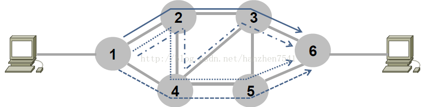

## [原文](https://blog.csdn.net/hanzhen7541/article/details/79030748)

# 网络层的作用

我们知道网络层处于数据链路层和传输层之间，它在数据报文包的传递中起到了重要作用。

  我们来看上面这张图。左边的主机想和右边的主机通话，那么这个数据包一定会经过网络。
中间灰色的圆圈是路由器，他们组成了一个网络，数据链路层只是把这个信息传递了“一跳”，
也就是从介质的一端传递到另一端，在图里面比如说从路由器1传递到2.但是网络层做的事情是，
规划好所有跳的路线，比如说数据包要依次经过1,2,3,6才能从左边主机到达右边主机，
这就是网络层一个非常重要的作用，也就是提供“路由routing”。

  别看这个功能看似简单，实际上非常复杂，因为网络是动态可变的，每个链路成本可能都在变化，
网络层需要时刻都对于每一个数据包给定最佳的路线，这就涉及到路由器的各种确定最佳路线的算法，
比如距离矢量算法和链路状态算法等等，可以看文中末尾的拓展部分。

  网络层除了上面说的第一个功能--路由选择以外，还有第二个功能：存储、交换、转发。
具体来说这是具体的网络中路由器做的事情。路由器中存在着路由表，
路由表的作用是为路由器提供包的方向依据。
路由器会根据每个到达包的目的地址来确定他应该向那个方向转发这个包。这个就是转发的功能。
当路由器接收包的速度要小于它转发包的作用时候，
他就会把暂时发送不了的包缓存在自己的缓冲区里面，直到前面的都发出去再将其发出去，这就是存储。

  第三个功能是拥塞控制。拥塞控制是网络设计的时候必不可少的功能。
就像城市里面哪里堵车了，其他人就知道不要再去了，网络层也一样。
比如上图中2，3路由器出现了严重的拥塞，那么左边主机往右边发送包就会从1236变成1456。
拥塞控制对于网络的效率以及降低丢包率有着无可替代的作用。

  网络层第四个作用是呼叫准入。什么是呼叫准入呢？比如左边主机想传一个大的视频文件给右边的主机，
但是网络这个时候非常拥挤很难传送。首先左主机先发送一个控制包给右主机，
这个控制包说明了自己视频数据所需要的带宽等等信息，
那么这个包所途径的路由器都会首先查看自己能不能满足这个需求，
如果不能就返回一个不能的信息，如果能就按照路由表向右主机传送。
所以一旦有一个路由器不能提供这个服务，那么呼叫建立就失败了，否则只要所以路由器许可，才能传送。
呼叫准入是在网络层所选路径沿途的路由器，在真正数据交换之前握手协商状态信息。
呼叫准入是为了保证网络的服务质量而设计的功能。

  网络层的核心就是路由器的功能，上面的几个功能，比如路由，存储转发，拥塞控制，
呼叫准入都是路由器的功能，除此以外，路由器还有包分类的功能。
比如说一个直播视频和一个ftp文件流都需要一个路由器转发，那么视频流肯定是优先级更高的，
因为直播的高延迟是不可忍受的，所以路由器会根据不同包确定优先级，
优先转发高优先级的，低优先级的需要在高优先级转发之后再转发。

  上面就是网络层和路由器的作用。
