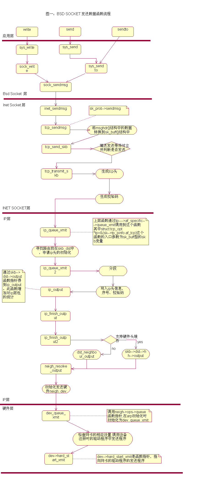
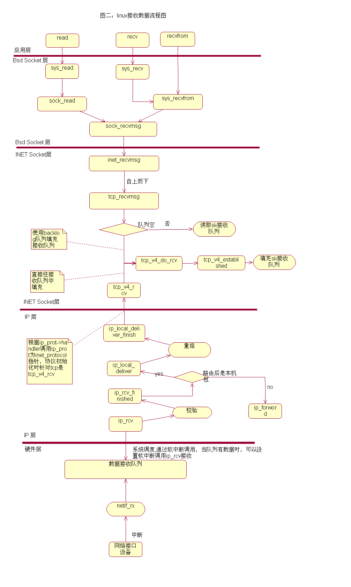
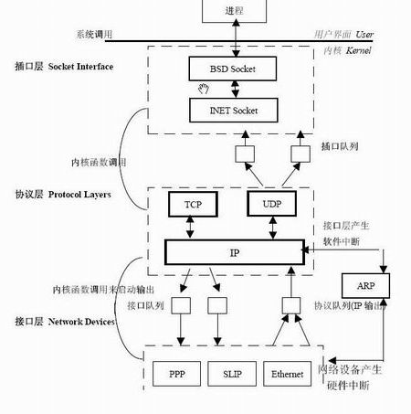

## [原文](https://www.cnblogs.com/my_life/articles/4691254.html)

# Linux TCP/IP 协议栈源码分析

## 一.linux内核网络栈代码的准备知识

### 1. linux内核ipv4网络部分分层结构：

- BSD socket层： 这一部分处理BSD socket相关操作，
  每个socket在内核中以struct socket结构体现。
  这一部分的文件主要有：/net/socket.c /net/protocols.c etc 

- INET socket层：BSD socket是个可以用于各种网络协议的接口，而当用于tcp/ip，
  即建立了AF_INET形式的socket时，还需要保留些额外的参数，
  于是就有了struct sock结构。文件主要

   有：/net/ipv4/protocol.c /net/ipv4/af_inet.c /net/core/sock.c etc 
   
- TCP/UDP层：处理传输层的操作，传输层用struct inet_protocol和struct proto两个结构表示。
   文件主要有：

　　/net/ipv4/udp.c /net/ipv4/datagram.c /net/ipv4/tcp.c /net/ipv4/tcp_input.c
   /net/ipv4//tcp_output.c /net/ipv4/tcp_minisocks.c 
   /net/ipv4/tcp_output.c /net/ipv4/tcp_timer.c

　　etc   

- IP层：处理网络层的操作，网络层用struct packet_type结构表示。
  文件主要有：/net/ipv4/ip_forward.c  ip_fragment.c ip_input.c ip_output.c etc. 

- 数据链路层和驱动程序：每个网络设备以struct net_device表示，
  通用的处理在dev.c中，驱动程序都在/driver/net目录下。

 

### 4.2 数据发送流程图


 

### 4.3 数据接收流程图


 

 

 

### 1.1 内核源代码的组织

表1是本文要使用的Linux Net/4网络源代码的,其中大部分位于目录/usr/src/linux-2.2.x/net,列表如下，

```
插口层 
BSD Socket 
/net/socket.c 
/net/protocols.c 
INET Socket 
/ipv4/protocol.c 
/ipv4/af_inet.c 
/net/ipv4/core/sock.c 
协议层 
TCP/UDP 
/net/ipv4/udp.c 
/net/ipv4/datagram.c 
/net/ipv4/tcp_input.c 
/net/ipv4//tcp_output.c 
/net/ipv4/tcp.c 
/net/ipv4/tcp_minisocks.c 
/net/ipv4/tcp_timer.c etc... 
IP 
/net/ipv4/ip_forward.c 
/net/ipv4/ip_fragment.c 
/net/ipv4/ip_input.c 
/net/ipv4/ip_output.c 
接口层 
Ethernet 
......
```

### 1.2  Linux中TCP/IP网络层次结构与实现 
Linux通过一组相邻的软件层实现了TCP/IP模型，它由BSD Socket层、INET Socket层、
 传输层、网络层，和链路层构成。应用程序使用系统调用向内核函数传递参数和数据从而进入内核空间，
 由内核中注册的内核函数对相应的数据结构进行处理。

Linux的TCP/IP层次结构和实现方式如图 1 所示。


