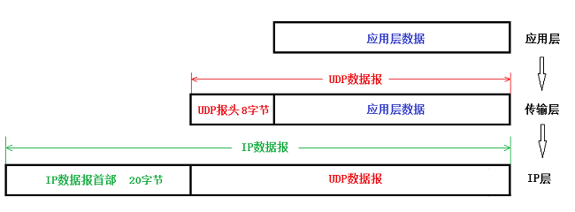

## [原文](https://blog.csdn.net/why_still_confused/article/details/51658930)

# UDP协议的特点
 
(1)  UDP是无连接的，即发送数据之前不需要建立连接，因此减少了开销和发送数据之前的时延。

(2)  UDP使用尽最大努力交付，即不保证可靠交付，因此主机不需要维持复杂的连接状态表。

(3)  UDP是面向报文的。发送方的UDP对应用程序交下来的报文，在添加首部后就向下交付IP层。
UDP对应用层交下来的报文，既不合并，也不拆分，而是保留这些报文的边界。因此，应用程序必须选择合适大小的报文。

(4)  UDP没有拥塞控制，因此网络出现的拥塞不会使源主机的发送速率降低。
很多的实时应用（如IP电话、实时视频会议等）要去源主机以恒定的速率发送数据，并且允许在网络发生拥塞时丢失一些数据，
但却不允许数据有太多的时延。UDP正好符合这种要求。

(5)  UDP支持一对一、一对多、多对一和多对多的交互通信。

(6)  UDP的首部开销小，只有8个字节，比TCP的20个字节的首部要短。

 

## 注意：

(1)  不使用拥塞控制功能的UDP有可能会引起网络产生严重的拥塞问题。

(2)  一些使用UDP的实时应用进程本身可以在不影响应用的实时性的前提下，
增加一些提高可靠性的措施，如采用前向纠错或重传已丢失的报文。
 