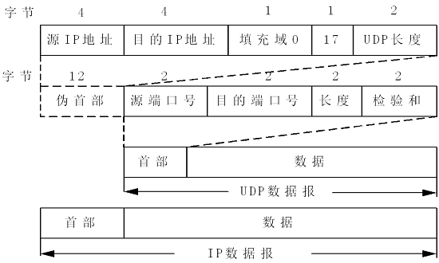

## [原文](https://blog.csdn.net/why_still_confused/article/details/51658930)

# UDP的首部格式

用户数据报UDP有两个字段：数据字段和首部字段。首部字段很简单，只有8个字节，由四个字段组成，每个字段的长度都是两个字节。
各字段的意义如下：

(1)  源端口      源端口号。在需要对方回信时选用。不需要时可用全0。

(2)  目的端口    目的端口号。 这在终点交付报文时必须要使用到。

(3)  长度        UDP用户数据报的长度，其最小值是8（仅有首部）

(4)  检验和      检测UDP用户数据报在传输中是否有错。有错就丢弃。

 

       一个UDP模块必须提供产生和验证检验和的功能，但是一个应用程序在使用UDP服务时，可以自由选择是否要求产生校检和。
在计算校检和时，要在UDP用户数据报之前增加12字节的伪首部。校检和就是按照这个临时的UDP用户数据报来计算的。

       UDP计算校检和的方法和计算IP数据报首部校检和的方法相似。
但不同的是：IP数据报的校检和只校检IP数据报的首部，但UDP的校检和使把首部和数据部分一起都校检。

 