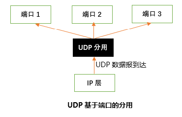
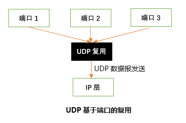

## [原文](https://blog.csdn.net/why_still_confused/article/details/51658930)

# UDP的复用和分用

当运输层从IP层收到UDP数据报时，就根据首部中的目的端口，
把UDP数据报通过相应的端口，上交到最后的终点——应用进程。
下图是UDP基于端口分用的示意图。

       基于端口的复用示意图与上图相似，只是数据报的传输方向相反。

       如果接收方UDP发现收到的报文中的目的端口号不正确（即不存在对应于该端口号的应用进程），
就丢弃该报文，并由网际控制报文协议ICMP发送“端口不可达”差错报文给发送方。

 