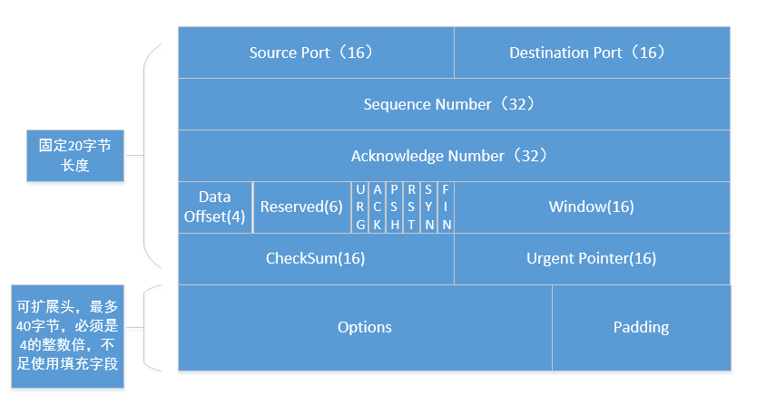

## [原文](https://www.jianshu.com/p/af8e7501e10a)

# TCP 请求头



 
## Source Port（源端口）：
源端口号 （占用16位），发送端程序端口

## Destination Port（目的端口）：
目的端口号（占用16位），接收端程序端口

##  Sequence Number（发送数据序号）：
用来标识从TCP发端向TCP收端发送的数据字节流，
它表示在这个报文段中的的第一个数据字节在数据流中的序号；主要用来解决网络报乱序的问题；（占用32位）

## Acknowledgment Number （ACK 确认号）： 
32位确认序列号包含发送确认的一端所期望收到的下一个序号，
因此，确认序号应当是上次已成功收到数据字节序号加1。
不过，只有当标志位中的ACK标志（下面介绍）为1时该确认序列号的字段才有效。
主要用来解决不丢包的问题；

```
例如：传输一个文件，文件比较大的 TCP 会把该文件拆成多段进行发送，
假如每段1000个字节，第一次的时候 Sequence Number 会随机一个 int 数值，假如为1。
第一次发送 Sequence Number=1，
第一次响应 Acknowledgment Number = 1001
第二次发送 Sequence Number=1001
第二次响应 Acknowledgment Number = 2001
... ...
```

## Data Offset（数据偏移量） ： 
数据偏移量（4位）给出首部中32 bit字的数目，
需要这个值是因为任选字段的长度是可变的。这个字段占4bit（最多能表示15个32bit的的字，
即4*15=60个字节的首部长度），因此TCP最多有60字节的首部。
然而，没有任选字段，正常的长度是20字节； 如果有额外的 TCP 的 option 选项，
还得加上 option 的长度。

## Reserved（保留字段）：
保留字段，目前还没有使用。

## TCP Flags（控制位） ：
TCP控制位（6位），每一位代表一个控制位，
它们中的多个可同时被设置为1，主要是用于操控TCP的状态机的，
依次为URG，ACK，PSH，RST，SYN，FIN。每个标志位的意思如下：

- URG：此标志表示TCP包的紧急指针域（后面马上就要说到）有效，用来保证TCP连接不被中断，
并且督促中间层设备要尽快处理这些数据；

- ACK：此标志表示应答域有效，就是说前面所说的TCP应答号将会包含在TCP数据包中；
有两个取值：0和1，为1的时候表示应答域有效，反之为0；

- PSH：这个标志位表示Push操作。所谓Push操作就是指在数据包到达接收端以后，
立即传送给应用程序，而不是在缓冲区中排队；

- RST：这个标志表示连接复位请求。用来复位那些产生错误的连接，也被用来拒绝错误和非法的数据包；

- SYN：表示同步序号，用来建立连接。SYN标志位和ACK标志位搭配使用，
当连接请求的时候，SYN=1，ACK=0；连接被响应的时候，SYN=1，ACK=1；
这个标志的数据包经常被用来进行端口扫描。扫描者发送一个只有SYN的数据包，
如果对方主机响应了一个数据包回来 ，就表明这台主机存在这个端口；
但是由于这种扫描方式只是进行TCP三次握手的第一次握手，
因此这种扫描的成功表示被扫描的机器不很安全，
一台安全的主机将会强制要求一个连接严格的进行TCP的三次握手；

- FIN： 表示发送端已经达到数据末尾，也就是说双方的数据传送完成，
没有数据可以传送了，发送FIN标志位的TCP数据包后，连接将被断开。
这个标志的数据包也经常被用于进行端口扫描。

## Window（窗口） ：
窗口大小（16位），表示接收端可用缓冲区大小，
根据缓冲区大小和每次包大小，就可以计算出同时处理的 TCP 包的个数。同时处理的包个数越多，则网速越快。

##Checksum （校验和）： 
用来检查 TCP 包是否完整（16位）

## Urgent Pointer （紧急指针）：
表示应紧急处理的数据位置（16位）。
路由器可以把紧急的数据包优先处理。

##Options（可选字段）：
可选字段，可变长度，最长为40字节。
（因为 Data Offset 最多能表示60个字节长度的 TCP 头信息，固定的 TCP 头部为 20 字节）

##Padding （填充）：
填充位。因为 Data Offset 只能表示 TCP 头部的长度 必须是 4 字节的整倍数。
如果 Options 选项不足 4字节的整倍数，就需要 Padding 填充为 4 字节的整倍数。

 