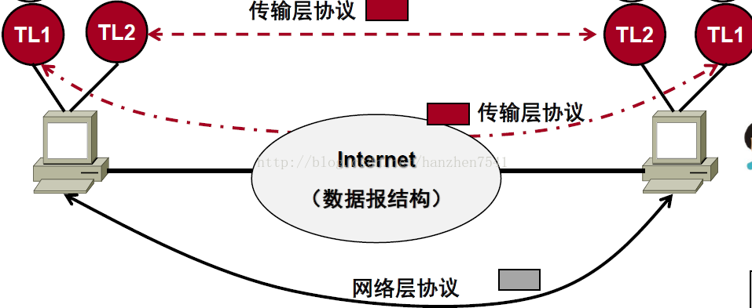

## [原文](https://blog.csdn.net/hanzhen7541/article/details/79071615)

# 传输层的作用

我们知道传输层位于网络层之上，网络层提供了主机之间的逻辑通道。

那既然已经把一个数据包从一个主机发到另一个主机上面了,为什么还需要传输层呢？  
>这是因为传输层提供了应用进程之间的端-端连接。

我们知道一个电脑可能有多个进程同时在使用网络连接，那么网络包达到主机之后，怎么区分自己属于那个进程？
>这就需要靠传输层的作用了。
 
传输层协议能提供应用的多路复用/分用服务、可靠数据传送、带宽保证及延迟保证等。
网络层提供的是“best effort”尽力而为的服务，网络层提供的无连接服务不可靠(丢包、重复)，
并且路由器可能崩溃，或者传输线路中断，所以传输层必须足够健壮来解决网络层不可靠，不稳定的问题，
比如说传输层可检测到包丢失、损坏、乱序等差错情况，采取相应措施；
或者当数据传输过程中网络连接中断，传输层可与远程传输实体建立一新的网络连接，在中断处继续数据的传输。
 

传输层（TL）和网络层的关系如上图所示

那么具体解释一下传输层的作用：

第一，多路复用和分用。
- 复用：当传输层从应用程序接收报文后要封装在传输层的段中再交给网络层发送。
- 分用：当传输层从网络层接收数据后，必须将数据正确递交给某个应用程序。

也就是传输层曾能够区分不同进程的数据并且加以区分处理。
可靠数据传输，比如传输层的TCP协议，提供了面向连接的，
可靠的，具有拥塞控制的协议，这是为了弥补网络层不足所建立的。

此外，传输层还有寻址的功能，定位应用程序在哪里。
以及流量的控制，防止接收端速度太慢造成溢出和丢包的现象。
流量控制和拥塞控制的区别是：流量控制只是端端之间，
只需要管理两个端之间的流量传输即可，也就是局部的。

但是拥塞控制是全局的，是整个网络所做的事情，
需要所有的路由器主机一起努力完成的事情。在传输层，既有流量控制也有拥塞控制。

传输协议要解决的问题取决于网络底层所能提供的服务质量。
我们能看出来，传输层除了分用复用以外，
好多功能都是针对性的弥补网络层的不足而产生的。
两者对应来理解，会对于传输层和网络层有更深的理解
