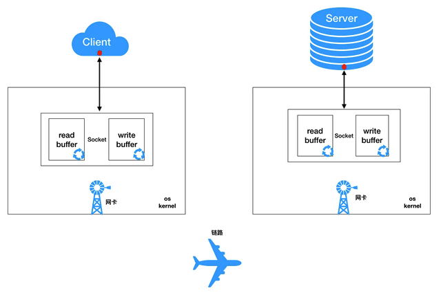

## [原文](https://coolshell.cn/articles/11564.html)

# 引言 

OSI 7层封包解包动态图-数据在网络中的传输过程

TCP是一个巨复杂的协议，因为他要解决很多问题，而这些问题又带出了很多子问题和阴暗面。
所以学习TCP本身是个比较痛苦的过程，但对于学习的过程却能让人有很多收获。
关于TCP这个协议的细节，
我还是推荐你去看[W.Richard Stevens](http://www.kohala.com/start/)的[《TCP/IP 详解 卷1：协议》](https://book.douban.com/subject/1088054/)
（当然，你也可以去读一下RFC793以及后面N多的RFC）。
另外，本文我会使用英文术语，这样方便你通过这些英文关键词来查找相关的技术文档。
  
##  之所以想写这篇文章，目的有三个，
  
- 一个是想锻炼一下自己是否可以用简单的篇幅把这么复杂的TCP协议描清楚的能力。

- 另一个是觉得现在的好多程序员基本上不会认认真真地读本书，喜欢快餐文化，
所以，希望这篇快餐文章可以让你对TCP这个古典技术有所了解，并能体会到软件设计中的种种难处。
并且你可以从中有一些软件设计上的收获。
  
- 最重要的希望这些基础知识可以让你搞清很多以前一些似是而非的东西，并且你能意识到基础的重要。
  所以，本文不会面面俱到，只是对TCP协议、算法和原理的科普。
  

我本来只想写一个篇幅的文章的，但是TCP真TMD的复杂，比C++复杂多了，这30多年来，各种优化变种争论和修改。
所以，写着写着就发现只有砍成两篇。

- 上篇中，主要向你介绍TCP协议的定义和丢包时的重传机制。
- 下篇中，重点介绍TCP的流迭、拥塞处理。

废话少说，首先，我们需要知道TCP在网络OSI的七层模型中的第四层——Transport层，
IP在第三层——Network层，
ARP在第二层——Data Link层，
在第二层上的数据，我们叫Frame，
在第三层上的数据叫Packet，
第四层的数据叫Segment。

首先，我们需要知道，我们程序的数据首先会打到TCP的Segment中，
然后TCP的Segment会打到IP的Packet中，
然后再打到以太网Ethernet的Frame中，传到对端后，
各个层解析自己的协议，然后把数据交给更高层的协议处理。
 
 

 
###  [TCP头格式](2_TCP头格式.md)

 