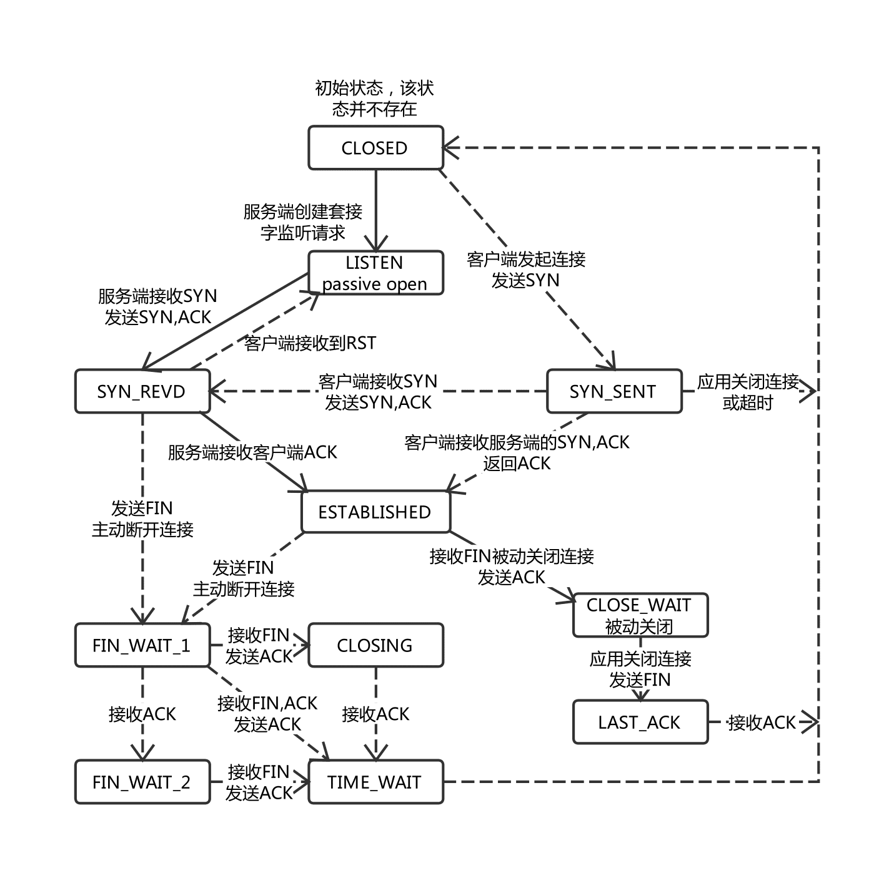

## [原文](https://www.jianshu.com/p/3c7a0771b67e)

# TCP连接状态

一个TCP连接在它的生命周期内会有不同的状态。
下图说明了TCP连接可能会有的状态，以及基于事件的状态转换。事件中有的是应用程序的操作，有的是接收到了网络发过来的请求。

TCP状态及其描述如下表。

状态 | 描述
|---|---
LISTEN | 等待来自远程TCP应用程序的请求
SYN_SENT| 发送连接请求后等待来自远程端点的确认。TCP第一次握手后客户端所处的状态
SYN-RECEIVED | 该端点已经接收到连接请求并发送确认。该端点正在等待最终确认。TCP第二次握手后服务端所处的状态
ESTABLISHED | 代表连接已经建立起来了。这是连接数据传输阶段的正常状态
FIN_WAIT_1 | 等待来自远程TCP的终止连接请求或终止请求的确认
FIN_WAIT_2 | 在此端点发送终止连接请求后，等待来自远程TCP的连接终止请求
CLOSE_WAIT | 该端点已经收到来自远程端点的关闭请求，此TCP正在等待本地应用程序的连接终止请求
CLOSING    |   等待来自远程TCP的连接终止请求确认
LAST_ACK   |  等待先前发送到远程TCP的连接终止请求的确认
TIME_WAIT | 等待足够的时间来确保远程TCP接收到其连接终止请求的确认

 