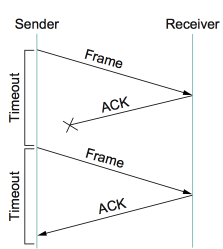

## [原文](https://www.jianshu.com/p/36a783392a72)

# TCP的拥塞控制

> 拥塞窗口（Congestion Window简称cwnd）：指某一源端数据流在一个RTT内可以最多发送的数据包数。

> TCP的核心是拥塞控制，目的是探测网络速度，保证传输顺畅

## 1.什么是拥塞控制

考虑这样一种情况，两个主机（source1 和 source2）通过同一条链路向目的主机发送数据，
但数据发送的速率远远超过了链路能够承受的范围
（此例中，source1 和 source2 的发送速率为 100M,但链路的带宽只有1.5M），
因此路由器的缓存区会很快被占满，当路由器的缓存区用完之后，
之后在传送过来的数据就会被丢弃，这种情况就叫做网络拥塞。
为了防止这钟情况，我们就需要进行拥塞控制。

## 2.如何进行拥塞控制
实际上，拥塞控制会有两种大的方案：以路由器为中心和以主机为中心。
所谓以路由器为中心，是指主要由路由器来处理拥塞，
具体指当路由器的缓存区用完或者即将用完的时候，
路由器主动通知主机调整发送速率从而避免拥塞，这就要求路由器有较强的网络处理功能。
而以主机为中心是指拥塞处理主要由主机来进行，
即主机要可以检测网络拥塞并当发生拥塞时可以对自己的发送速率进行调整。

现在主要运行的拥塞处理方案都是以主机为中心来处理的。
这样做的原因是因为一般来说，主机都具有比较强的数据处理能力（比如电脑），
可以进行很多复杂的处理，所以我们希望将较为复杂的功能都放在主机上进行处理，而将网络设备做的尽量的简单。

## 3.TCP的拥塞控制方案

### TCP如何处理拥塞

拥塞控制主要是四个算法：

- 1）慢启动
- 2）拥塞避免
- 3）拥塞发生
- 4）快速恢复

### TCP是如今主要的传输层协议，那么TCP是如何进行拥塞处理的呢？

之前说过主机如果要进行拥塞控制，那么就要求主机能够给检测拥塞的发生，
并当拥塞发生时，对自己的发送速率进行调整。
下面我们就从这两个方面来看看TCP是如何处理拥塞的。

### TCP如何检测拥塞
我们知道，TCP发送方每传送一个字节的数据，TCP接收方都会返回一个ACK（acknowledgement）来通知发送方自己收到了这个数据。
TCP发送方接收到ACK后才会进行下一个数据的传输，
这样就提供了传输的可靠性。
整个过程大致是这样的：

而如何发送方如果长时间没收到ACK的话，就会对数据进行重发：

如果没收到ACK，TCP就会认为网络发生了拥塞。每发生一次超时，TCP就认为是发生了一次拥塞。

当TCP检测到网络拥塞时，很自然的想法是TCP发送方需要主动降低自己的发送速率。
时间上TCP也正是这样做的，TCP通过维护一个拥塞窗口（Congestion Window）的变量来限制给定时间内允许传送的数据量。
具体策略是：

每检测到一次拥塞，TCP发送方就将拥塞窗口设为当前值的一半。
每当数据成功发送，TCP发送方就将拥塞窗口大小+1。
整个过程大致是这样：

这种策略即所谓的累次增加/成倍减少(AIMD)

### 慢启动
另外的一个问题是拥塞窗口从0开始时，可能需要很长的时间才能增加到`网络的极限值`，
因此TCP需要提供一种机制，使拥塞窗口从0开始增加时，能够`迅速增加`到网络的极限值。
TCP提供一种叫做`慢启动`的方式来达到这个需求。

#### 慢启动的解决方案

- TCP初始启动时，设置拥塞窗口 cwnd 为1

- 慢启动阶段：以指数方式增加cwnd直到特定门限值ssthresh
> ssthresh: slow start threshold

- 拥塞避免阶段：超过ssthresh后，cwnd加性增加

- 再次拥塞时，ssthresh值减半，重新进入慢启动阶段

整个过程大致如下：

## 4.总结

- 拥塞是指发送方的速率超过线路带宽而造成丢包的情况

- 拥塞控制有以路由器为中心和以主机为中心两种方式，现在主要通过以主机为中心的方式进行处理

- TCP通过超时来检测网络拥塞

- TCP维护一个拥塞窗口变量来调整发送速率，通过累次增加/成倍减少(AIMD)和慢启动的方式来处理拥塞。

