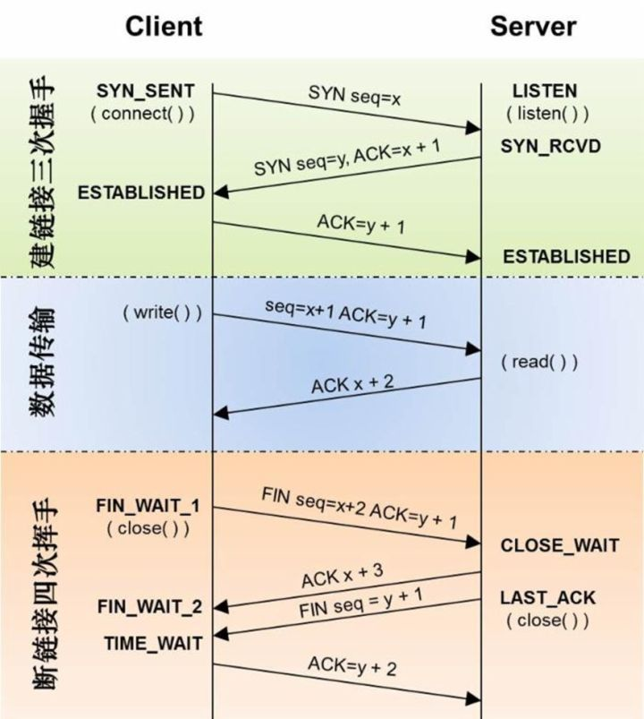

## [原文](https://juejin.im/post/5a7835a46fb9a063606eb801)
 

## 三次握手

### 第一次握手
client发送一个SYN(J)包给server，然后等待server的ACK回复，进入SYN-SENT状态。p.s: SYN为synchronize的缩写，ACK为acknowledgment的缩写。

### 第二次握手
server接收到SYN(seq=J)包后就返回一个ACK(J+1)包以及一个自己的**SYN(K)**包，然后等待client的ACK回复，server进入SYN-RECIVED状态。

### 第三次握手
client接收到server发回的ACK(J+1)包后，进入ESTABLISHED状态。
然后根据server发来的SYN(K)包，返回给等待中的server一个ACK(K+1)包。等待中的server收到ACK回复，也把自己的状态设置为ESTABLISHED。
到此TCP三次握手完成，client与server可以正常进行通信了。

 
 
### 为什么要进行三次握手

`确保证双方互相明确对方能收能发的最低值`

我们来看一下为什么需要进行三次握手，两次握手难道不行么？
这里我们用一个生活中的具体例子来解释就很好理解了。
我们可以将三次握手中的客户端和服务器之间的握手过程比喻成A和B通信的过程：

在第一次通信过程中，A向B发送信息之后，
B收到信息后可以确认自己的收信能力和A的发信能力没有问题。

在第二次通信中，B向A发送信息之后，
A可以确认自己的发信能力和B的收信能力没有问题，
但是B不知道自己的发信能力到底如何，所以就需要第三次通信。

在第三次通信中，A向B发送信息之后，B就可以确认自己的发信能力没有问题。

**确保证双方互相明确对方能收能发的最低值**

## 四次挥手

### 第一次挥手
client发送一个FIN(M)包，此时client进入FIN-WAIT-1状态，这表明client已经没有数据要发送了。

### 第二次挥手
server收到了client发来的FIN(M)包后，向client发回一个ACK(M+1)包，
此时server进入CLOSE-WAIT状态，client进入FIN-WAIT-2状态。

### 第三次挥手
server向client发送FIN(N)包，请求关闭连接，同时server进入LAST-ACK状态。

### 第四次挥手
client收到server发送的FIN(N)包，进入TIME-WAIT状态。
向server发送**ACK(N+1)**包，server收到client的ACK(N+1)包以后，进入CLOSE状态；
client`等待一段时间还没有得到回复后`判断server已正式关闭，进入CLOSE状态。

 

