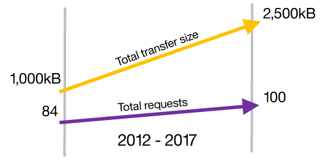

# HTTP/2 是什么？

HTTP/2 的首要目标是改善 Web 应用程序用户的体验。
HTTP 1.1 是一个二进制协议，它拥有包括轻量型、安全和快速在内的所有优势。
HTTP/2 保持了原始 HTTP 协议的语义，但更改了在系统之间传输数据的方式。
请查看我的文章“HTTP/2 幕后原理”（developerWorks，2017 年 7 月），深入了解 HTTP/2。

# HTTP/2 幕后原理

HTTP/2 的请求/响应复用、报头压缩和服务器推送如何提升网站性能.

HTTP/2 的首要目标是改善 Web 应用程序用户的体验。
作为一个二进制协议，它拥有包括轻量型、安全和快速在内的所有优势。
HTTP/2 保留了原始 HTTP 协议的语义，但更改了在系统之间传输数据的方式。
这些复杂细节主要由客户端和服务器管理，所以网站和应用程序无需重大更改即可享受 HTTP/2 的优势。

本文将概述 HTTP/2，包括它试图解决的问题，以及它的大量新的性能增强特性 — 包括请求/响应复用、报头压缩和服务器推送。

## HTTP 的历史

在深入介绍 HTTP/2 协议的细节之前，让我们回到过去并回顾一下HTTP 中的起源。

该协议于 1989 年首次曝光，以 HTTP 0.9 的形式面世。
Timothy Berners-Lee 在瑞士日内瓦附近的 CERN 上首次提到它时，它仅包含 1 行代码。
唯一的方法是 GET，还有一个像下面这个示例这样简单的请求：GET /index.html。响应同样很简单，仅包含所请求的文件。

HTTP 0.9 不是一个正式标准，通过这种方式引用它是为了将它与随后的正式版本区分开。
1996 年，推出了 HTTP 1.0 作为 IEFT 标准（依据 [RFC 1945](https://tools.ietf.org/search/rfc1945)）。
1999 年，在 [RFC 2616](https://tools.ietf.org/search/rfc2616) 中发布了 HTTP 1.1。
第一个主要版本中的缺点促使人们在 1999 年进行了一次小幅修订，引入了大量可选特性和零碎细节 — 并消除了一些不好的方面。

几乎没有浏览器（或服务器）实现会采用该协议的每个方面，这导致不同浏览器间的用户体验不一致。
显然，浏览器供应商无法实现 HTTP 1.1 中引入的 HTTP 管道的性能增强特性。

您可以亲自查看：在最近的一次演示中，Cloudflare 通过 HTTP 1.1 和 HTTP/2 加载了 200 个图像切片，然后比较了加载时间。

随着网络的使用变得更加普遍，性能需求呈指数级增长，而对 HTTP 的需求阻碍了性能提升。
开发人员开始创建工具来克服该协议的不足。例如，HTTP 对 TCP 套接字的低效使用限制了性能，
所以开发人员退而使用精心设计的服务器架构(racks of servers)来满足应用程序需求。
从这个角度讲，未能让管道正常工作，促使人们开始着重反思 HTTP 的需求。

15 年后，才成立了 [HTTPbis](https://datatracker.ietf.org/wg/httpbis/charter/) 工作组来正式识别该协议的棘手问题，
并最终起草对 HTTP/2 的预期。
怀着显著改善最终用户对 HTTP 1.1 延迟的认知的使命，
该工作组的协议推荐包含针对 “线头阻塞” 问题、报头压缩和服务器推送的精选解决方案。
RFC [7540](https://tools.ietf.org/html/rfc7540) (HTTP/2) 和 7541 (HPACK) 的结合，
预示着 Web 应用程序性能将急剧提升。

## HTTP 的现状

自万维网诞生以来，网页变得愈加复杂。第一批网页非常简单，仅包含文本：没有图像，没有 CSS，没有 JavaScript，
只有普通的 HTML。快进到今天，平均每个网页就包含 100 多个下载资源，大小约为 2,500 KB。
总传输大小自 2012 年 5 月以来增长了 250%，这种持续增长没有出现缓和迹象。

### 工具和变通方案
尽管互联网确实能快速提供高度复杂的内容，但出现这样的结果并不是因为 HTTP 1.1 协议（尽管采用了该协议）。
在当前版本中，HTTP 无法满足如今的 Web 体验需求。因此，Web 开发人员针对这些性能问题提供了一系列变通方案。
让我们来看一些比较流行的工具和它们修补的问题。

### 线头阻塞
HTTP 1.0 仅允许通过一个 TCP 连接发出一个请求。这引发了所谓的 “线头阻塞” 问题，迫使浏览器等待缓慢的响应。
HTTP 1.1 通过管道解决了这个问题，管道使浏览器能并行发出多个请求。
但是，浏览器供应商很难实现管道，而且大多数浏览器（包括 Firefox）在发布时都会默认禁用该特性。Chrome 甚至完全删除了它。

### 多个 TCP 连接
打开 TCP 连接需要很高的成本，而且我们对客户端应如何使用它们知之甚少。
唯一的协议规定是，每个主机最多可以打开 2 个连接。由于只有 2 个 TCP 连接，
开发人员为了能够展示一个现代页面需要竞争这两个名额 — 所以他们找到了一种方法来绕过这一限制。

通过使用一种称为域分片（domain sharding）的流行技术，开发人员能创建多个主机，每个主机提供一个网站所需资源的一部分。
切分已变得非常普遍，网页加载期间打开的平均 TCP 连接数量也因此达到约 35 个（来源：HTTPArchive）。

浏览器供应商不甘示弱，他们也违反了该协议，任意增加浏览器实现中允许的开放连接数量。
这有助于并行化各个浏览器中的资源加载，但没有充分利用 TCP 套接字。
下表显示了每个主机名允许打开的端口的最高数量，以及最流行的 3 个浏览器在这方面的不同。

表 1. 并行打开的 TCP 连接的最大数量

浏览器	| 每个主机名的最大并行连接数
--|--
Chrome	| 24
Firefox |	6
Internet Explorer 12| 	11

浏览器实现中的不一致意味着，用户冲浪体验的质量取决于他们选择的浏览器，而不是网站的设计和构思有多精巧。

资源内联和级联
为了追求更高性能，Web 应用程序开发人员采用的聪明技巧并不只有域切分。

文件串联创建一个包含全部所需资源的大文件。为网站的所有 CSS 创建一个文件，为 JavaScript 创建一个文件，
为包含网站图标的图像子画面表创建另一个文件。
资源内联将 CSS 和 JavaScript 直接嵌入在 HTML 中，这使得嵌入图像也成为可能。
对图像进行 base64 编码，然后在加载网页时进行解码。
这些技术都不可取，尤其是从设计角度讲。在这两种情况下，页面的结构都与样式组合在一起，图像解码也会消耗很多时间。
缓存也无法轻松实现。

但是，如果目标只是减少请求的文件数量，那么这些变通方案是成功的。随着文件请求减少，需要打开的 TCP 套接字也会减少。

#### [转载](https://www.ibm.com/developerworks/cn/web/wa-http2-under-the-hood/index.html)