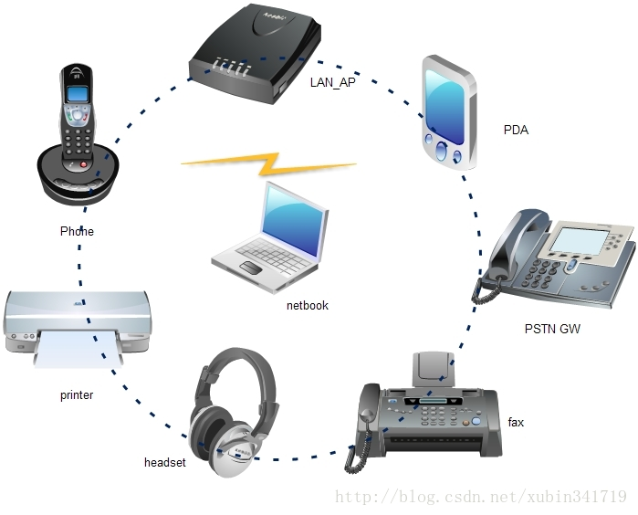

## [原文](https://blog.csdn.net/xubin341719/article/details/38145507)

# 蓝牙的工作原理

## 三、版本信息 

蓝牙共有六个版本V1.1/1.2/2.0/2.1/3.0/4.0  版本信息下载连接：

- 1、V1.1版本
传输率约在748~810kb/s，因是早期设计，容易受到同频率之产品所干扰下影响通讯质量。

- 2、V1.2版本
同样是只有748~810kb/s 的传输率，但在加上了(改善 Software)抗干扰跳频功能。

- 3、V2.0+EDR版本
是 1.2 的改良提升版，传输率约在1.8M/s~2.1M/s，开始支持双工模式——即一面作语音通讯，同时亦可以传输档案/高质素图片，
2.0 版本当然也支持 Stereo 运作。
应用最为广泛的是Bluetooth2.0+EDR标准，该标准在2004年已经推出，支持Bluetooth 2.0+EDR标准的产品也于2006年大量出现。
虽然Bluetooth 2.0+EDR标准在技术上作了大量的改进，但从1.X标准延续下来的配置流程复杂和设备功耗较大的问题依然存在。

- 4、V2.1版本
更佳的省电效果：蓝牙2.1版加入了SniffSubrating的功能，透过设定在2个装置之间互相确认讯号的发送间隔来达到节省功耗的目的。

- 5、V3.0+HS版本
2009年4月21日，蓝牙技术联盟(Bluetooth SIG)正式颁布了新一代标准规范"Bluetooth Core Specification Version 3.0 High Speed"(蓝牙核心规范3.0版 )，
蓝牙3.0的核心是"GenericAlternate MAC/PHY"(AMP)，这是一种全新的交替射频技术，
允许蓝牙协议栈针对任一任务动态地选择正确射频。最初被期望用于新规范的技术包括802.11以及UMB，但是新规范中取消了UMB的应用。

- 6、V4.0 版本
蓝牙4.0包括三个子规范，即传统蓝牙技术、高速蓝牙和新的蓝牙低功耗技术。蓝牙 4.0的改进之处主要体现在三个方面，
电池续航时间、节能和设备种类上。拥有低成本，跨厂商互操作性，3毫秒低延迟、100米以上超长距离、
AES-128加密等诸多特色此外，蓝牙4.0的有效传输距离也有所提升。3.0版本的蓝牙的有效传输距离为10米(约 32英尺)，
而蓝牙4.0的有效传输距离最高可达到100米(约328英尺)。

## 四、蓝牙的技术特点
简单地说，蓝牙是一种短程宽带无线电技术，是实现语音和数据无线传输的全球开放性标准。它使用跳频扩谱（FHSS）、
时分多址（TDMA）、码分多址（CDMA）等先进技术，在小范围内建立多种通信与信息系统之间的信息传输。

- 1、Bluetooth的主要技术特点：
（1）、工作频段：2.4GHz的工科医（ISM）频段，无需申请许可证。大多数国家使用79个频点，
载频为(2402+k)MHz（k=0，1, 2…78），载频间隔1MHz。采用TDD时分双工方式。

（2）、传输速率：1Mb/s（V2.0以上版本吗）

（3）、调试方式：BT=0.5的GFSK调制，调制指数为0.28-0.35。

（4）、采用跳频技术：跳频速率为1600跳/秒，在建链时（包括寻呼和查询）提高为3200跳/秒。
蓝牙通过快跳频和短分组技术减少同频干扰，保证传输的可靠性。

（5）、语音调制方式：连续可变斜率增量调制（CVSD，ContinuousVariable Slope Delta Modulation），
抗衰落性强，即使误码率达到4%，话音质量也可接受。

（6）、支持电路交换和分组交换业务：蓝牙支持实时的同步定向联接（SCO链路）和非实时的异步不定向联接（ACL链路），
前者主要传送语音等实时性强的信息，后者以数据包为主。语音和数据可以单独或同时传输。蓝牙支持一个异步数据通道，
或三个并发的同步话音通道，或同时传送异步数据和同步话音的通道。每个话音通道支持64kbps的同步话音；
异步通道支持723.2/57.6kbps的非对称双工通信或433.9kbps的对称全双工通信。

（7）、支持点对点及点对多点通信：蓝牙设备按特定方式可组成两种网络：微微网(Piconet)和分布式网络(Scatternet)，
其中微微网的建立由两台设备的连接开始，最多可由八台设备组成。在一个微微网中，只有一台为主设备（Master），
其它均为从设备（Slave），不同的主从设备对可以采用不同的链接方式，在一次通信中，链接方式也可以任意改变。
几个相互独立的微微网以特定方式链接在一起便构成了分布式网络。所有的蓝牙设备都是对等的，所以在蓝牙中没有基站的概念。

（8）、工作距离：蓝牙设备分为三个功率等级，分别是：100mW（20dBm）、2.5mW（4dBm）和1mW（0dBm），
相应的有效工作范围为：100米、10米和1米。

## 五、Bluetooth的系统构成

1、无线射频单元(Radio)：负责数据和语音的发送和接收，特点是短距离、低功耗。蓝牙天线一般体积小、重量轻，属于微带天线。
2、基带或链路控制单元(LinkController)：进行射频信号与数字或语音信号的相互转化，实现基带协议和其它的底层连接规程。
3、链路管理单元(LinkManager)：负责管理蓝牙设备之间的通信，实现链路的建立、验证、链路配置等操作。
4、蓝牙软件协议实现：如上图紫色部分，这个后面我们做详细说明。

## 六、蓝牙协议规范
传输协议、中介协议、应用协议；

- 1、传输协议
负责蓝牙设备间，互相确认对方的位置，以及建立和管理蓝牙设备间的物理链路；

  - 底层传输协议：
蓝牙射频（Radio）部分、基带链路管理控制器（Baseband&Link Controller）、
链路管理协议（Link ManagerProtocol LMP）。负责语言、数据无线传输的物理实现以及蓝牙设备间的联网组网。

  - 高层传输协议：
        逻辑链路控制与适配器（LogicalLink Control and Adaptation Protocol）L2CAP 、
主机控制接口（HostControl Interface，HCI）。为高层应用屏蔽了跳频序列选择等底层传输操作，为高层程序提供有效、
有利于实现数据分组格式。
- 2、中介协议
    为高层应用协议或者程序，在蓝牙逻辑链路上工作提供必要的支持，为应用提供不同标准接口。
     串口仿真协议：RFCOMM、服务发现协议：SDP、互操作协议IrDA、网络访问协议：PPP、IP、TCP、UDP、电话控制协议：TCS、AT指令集。

- 3、应用协议

      蓝牙协议栈之上的应用软件和所涉及到的协议，如：拨号上网、语言功能的应用程序。

蓝牙的应用框架如下：
（1）、通用应用类框架：查询、建立连接服务等；
（2）、蓝牙电话应用类框架：电话控制、语言；
（3）、蓝牙连网应用类框架：网络应用相关；
（4）、对象交互服务类框架：IrDA、OBEX；
（5）、蓝牙音视频控制类框架。

## 七、硬件接口

一般蓝牙芯片通过UART、USB、SDIO、I2S、PcCard和主控芯片通信。
如下图所示，通过UART和主控芯片通信。

## 八、Bluetooth的应用

- 蓝牙应用在手机上。 

- 蓝牙应用在掌上电脑上。 

- 蓝牙应用于其它数字设备，如数字照相机、数字摄象机等。  

- 蓝牙技术构成的电子钱包和电子锁。 

- 蓝牙系统嵌入微波炉、洗衣机、电冰箱、空调机等传统家用电器。

