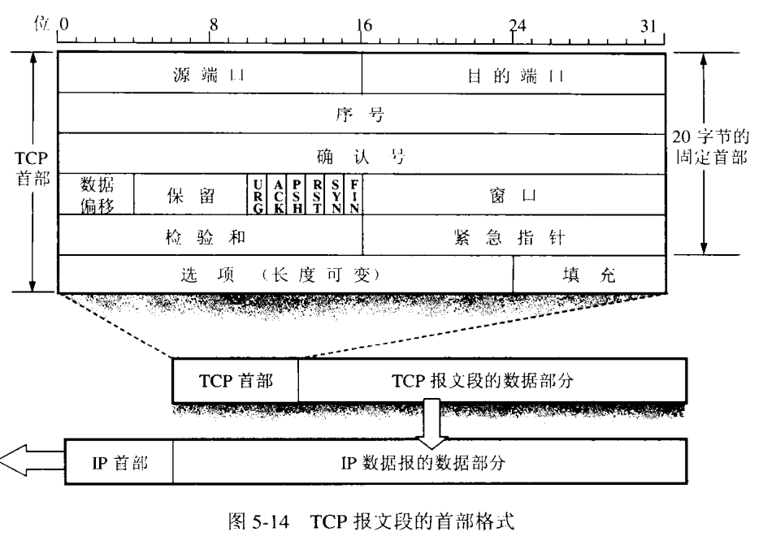

## [原文](https://www.jianshu.com/p/f35f386ea9c1)

# TCP协议首部格式

TCP协议首部最小长度是20字节，首部有一个长度可变的选项部分，
最大40字节，所以TCP首部长度是20-60字节大小。具体如图：

## 选取部分字段说明：

- 序号：TCP传输的时候每一个字节都按顺序编号；协议中的序号是本报文段所发送数据第一个字节的序号。
序号也用于建立和结束连接时候使用。

- 确认号：用于可靠传输中，返回确认报文序号。

- 数据偏移：指出数据段在报文中开始的位置。

- 窗口：可靠连接和流量控制中所用到的窗口大小。

上图中有六个控制位，对于建立和结束连接非常关键，解释如下：

1. URG(Urgent):紧急字段，可以让该报文不按报文顺序优先被处理。比如用户突然终止传输关闭连接。

2. ACK(Acknowledge):所有建立连接后传送的报文ACK必须为1.

3. PSH(Push):发送方讲该报文推送向前，可以不用等缓存填满先提交给应用程序。

4. RST(Reset):连接出现严重差错时候设为1，重新建立连接。也可用于拒绝建立连接。

5. SYN(Synchronize):建立连接时候的同步标志。SYN=1而ACK=0时表示建立连接请求。

6. FIN(Finish):终止时标志位。

另外，在选项中有这么几种选择：

1. 最大报文长度MSS(Maxium Segment Size),指的是一个TCP报文数据段的最大长度。
要尽可能大一些但是又不需要IP拆分。推荐是536字节，这样真个TCP报文长度是 536+20 = 556字节。

2. 窗口扩大选项。可用于控制传输窗口大小。

3. 时间戳。非常有用。可以用于 
  -  1）计算往返时间RTT 
  -  2）区分重复报文。
  
因为报文的序号只能是2^32-1个，所以很容易就重复了，加上时间戳可以进行区分。
 

