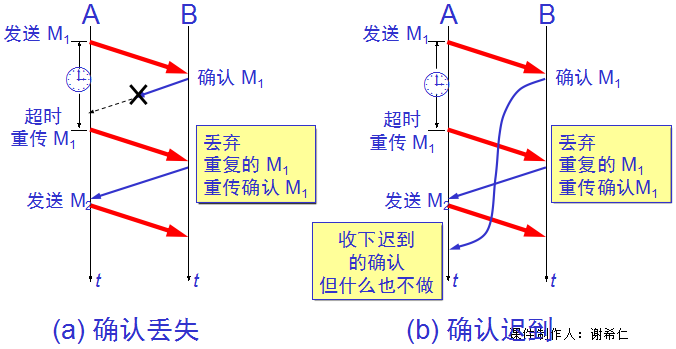

## [原文](https://my.oschina.net/xinxingegeya/blog/485233)

# TCP可靠传输的工作原理

## TCP 可靠传输的工作原理

- ARQ（Automatic Repeat-reQuest）（自动重传请求）

- 停止等待ARQ协议

- 连续ARQ协议

## 停止等待ARQ协议
全双工通信的双方既是发送方也是接收方。

下面为了讨论问题的方便，我们仅考虑A发送数据而B接受数据并发送确认。
因此A就做发送方，B叫做接收方。

因为这里是讨论可靠传输的原理，因此把传送的数据单元都称为分组，而并不考虑数据在哪一层次上传送的。
停止等待就是每发送完一个分组就停止发送，等待对方的确认。在收到确认后在发送下一个分组。

###  1.无差错情况

### 2.出现差错情况值超时重传

超时自动重传分组

- 在发送完一个分组后，必须暂时保留已发送的分组的副本。

- 分组和确认分组都必须进行编号。

- 超时计时器的重传时间应当比数据在分组传输的平均往返时间更长一些。

 

### 3.确认丢失和确认迟到

分组确认

使用上述的重传和确认机制，我们可以在不可靠的传输网络上实现可靠的通信。

> [重传和确认机制](TCP%20的那些事儿【coolshell.com】/4_TCP超时重传机制-其他其他篇.md)

像上述这种可靠传输协议常称为自动重传请求ARQ (Automatic Repeat reQuest)，ARQ 表明重传的请求是自动进行的。
接收方不需要请求发送方重传某个出错的分组 。

 

### 流水线传输(信道利用率)

- 发送方可连续发送多个分组，不必每发完一个分组就停顿下来等待对方的确认。

- 由于信道上一直有数据不间断地传送，这种传输方式可获得很高的信道利用率。 

当使用流水线传输时，就要使用下面介绍的连续ARQ协议和滑动窗口协议。

 

### 连续 ARQ 协议 
下图表示发送方维持的发送窗口，他的意义是：位于发送窗口内的5个分组都可以连续发送出去，
而不需 要等待对方的确认。这样信道利用率就提高了。

发送窗口是5 

连续ARQ协议规定，发送方每接收到一个确认，就把发送窗口向前滑动一个分组的位置。
下图表示发送方收到了第一个分组的确认，于是把发送窗口向前移动一个分组的位置。

如果原来已经发送了前5个分组，那么现在就可以发送窗口内的第六个分组。

接收方一般都采用累积确认的方式。这就是说接收方不必对收到的分组逐个发送确认，而是可以在几个分组后，
对按序到达的最后一个分组发送确认，这样就表示：到这个分组为止的所有分组都已经正确接收到了。

 

### 累积确认
接收方一般采用累积确认的方式。即不必对收到的分组逐个发送确认，而是对按序到达的最后一个分组发送确认 ，
这样就表示：到这个分组为止的所有分组都已正确收到了。

累积确认有的优点是：容易实现，即使确认丢失也不必重传。
缺点是：不能向发送方反映出接收方已经正确收到的所有分组的信息。

 

### Go-back-N（回退 N）
如果发送方发送了前 5 个分组，而中间的第 3 个分组丢失了。
这时接收方只能对前两个分组发出确认。发送方无法知道后面三个分组的下落，而只好把后面的三个分组都再重传一次。

这就叫做 Go-back-N（回退 N），表示需要再退回来重传已发送过的 N 个分组。

可见当通信线路质量不好时，连续 ARQ 协议会带来负面的影响。 

