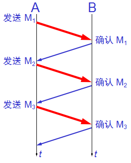

## [原文](https://blog.csdn.net/yangbodong22011/article/details/48473183)

# TCP协议总结--停止等待协议,连续ARQ协议,滑动窗口协议

### [停止等待协议](09、TCP可靠传输的工作原理.md)

停止等待协议是tcp保证传输可靠的重要途径,”停止等待”就是指发送完一个分组就停止发送,
等待对方的确认,只有对方确认过,才发送下一个分组。

- 1:无差错情况:发送方发送分组,接收方在规定时间内收到,并且回复确认.发送方再次发送…… 

 
- 2:超时重传有以下三种情况: 

(1)分组丢失:发送方发送分组,接收方没有收到分组,那么接收方不会发出确认,只要发送方过一段时间没有收到确认,
就认为刚才的分组丢了,那么发送方就会再次发送. 

(2):确认丢失:发送方发送成功,接收方接收成功,确认分组也被发送,但是分组丢失,那么到了等待时间,发送方没有收到确认,
又会发送分组过去,此时接收方前面已经收到了分组,那么此时接收方要做的事就是:丢弃分组,重新发送确认. 

(3):传送延迟:发送方发送成功,接收方接收成功,确认分组也被发送,没有丢失,但是由于传输太慢,等到了发送方设置的时间,
发送方又会重新发送分组,此时接收方要做的事情:丢弃分组,重新发送确认. 
发送方如果收到两个或者多个确认,就停止发送,丢弃其他确认. 

停止等待协议的优点是简单,但是缺点是信道的利用率太低,一次发送一条消息,
使得信道的大部分时间内都是空闲的,为了提高效率,我们采用流水线传输,
这就与下面两个协议有关系了.
 
 
## 连续ARQ协议和滑动窗口协议 
这两个协议主要解决的问题信道效率低和增大了吞吐量,以及控制流量的作用.

- 连续ARQ协议:它是指发送方维护着一个窗口,这个窗口中不止一个分组,有好几个分组,
窗口的大小是由接收方返回的win值决定的,所以窗口的大小是动态变化的,只要在窗口中的分组都可以被发送,
这就使得TCP一次不是只发送一个分组了,从而大大提高了信道的利用率.
并且它采用累积确认的方式,对于按序到达的最后一个分组发送确认.

- [滑动窗口协议](TCP%20的那些事儿【coolshell.com】/6_TCP滑动窗口和流控.md):
之所以叫滑动窗口协议,是因为窗口是不断向前走的,
该协议允许发送方在停止并等待确认前发送多个数据分组。由于发送方不必每发一个分组就停下来等待确认，
因此该协议可以加速数据的传输,还可以控制流量的问题.

- 累积确认:如果发送方发送了5个分组,接收方只收到了1,2,4,5,没有收到3分组,
那么我的确认信息只会说我期望下一个收到的分组是第三个,
此时发送方会将3,4,5,全部重发一次,当通信质量不是很好的时候,连续ARQ还是会带来负面影响.！