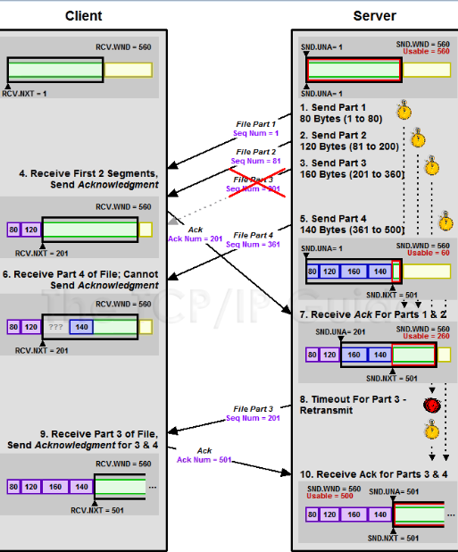
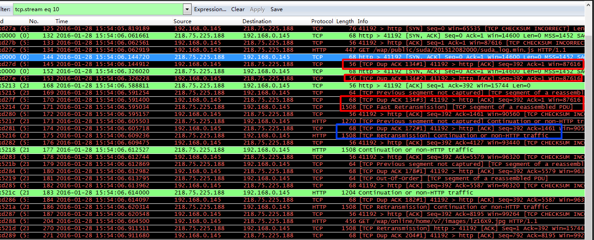

## [原文](https://blog.csdn.net/wdscq1234/article/details/52476231)

# TCP 超时重传机制

> 超时重传是TCP保证数据传输可靠性的又一大措施，本文主要介绍重传TCP报文的两大举措：超时重传和快速重传

## 超时重传机制

超时重传指的是，发送数据包在一定的时间周期内没有收到相应的ACK，
等待一定的时间，超时之后就认为这个数据包丢失，就会重新发送。
这个等待时间被称为RTO.  

检测丢失segment的方法从概念上讲还是比较简单的，每一次开始发送一个TCP segment的时候，就启动重传定时器，
定时器的时间一开始是一个预设的值（Linux 规定为1s），随着通讯的变化以及时间的推移，
这个定时器的溢出值是不断的在变化的，
有相关算法计算RTO,如果在ACK收到之前，定时器到期，
协议栈就会认为这个片段被丢失，重新传送数据。

TCP在实现重传机制的时候，需要保证能够在同一时刻有效的处理多个没有被确认的ACK，
也保证在合适的时候对每一个片段进行重传，有这样几点原则：

- 1.这些被发送的片段放在一个窗口中，等待被确认，没有确认不会从窗口中移走，
定时器在重传时间到期内，每个片段的位置不变，这个地方其实在滑动窗口的时候也有提到过

- 2.只有等到ACK收到的时候，变成发送并ACK的片段，才会被从窗口中移走。

- 3.如果定时器到期没有收到对应ACK， 就重传这个TCP segment

重传之后也没有办法完全保证，数据段一定被收到，所以仍然会重置定时器，
等待ACK，如果定时器到期还是没有收到ACK，继续重传，
这个过程重传的TCP segment一直留着队列之内。

举个重传的例子：

1. Server 发送80个字节 Part1，seq = 1 

2. Server 发送120个字节Part2，Seq = 81

3. Server发送160个字节Part3，Seq = 201，此包由于其他原因丢失

4. Client收到前2个报文段，并发送ACK = 201

5. Server发送140个字节Part4， Seq = 361

7. Server收到Client对于前两个报文段的ACK，将2个报文从窗口中移除，窗口有200个字节的余量

8. 报文3的重传定时器到期，没有收到ACK，进行重传

9. 这个时候Client已经收到报文4，存放在缓冲区中，也不会发送ACK【累计通知，发送ACK就表示3也收到了】，
等待报文3，报文3收到之后，一块对3,4进行确认

10. Server收到确认之后，将报文3,4移除窗口，所有数据发送完成

这种方式会面临一个问题：客户端在等待报文3的时候，服务器如何处理报文4， 
客户端这个期间内并没有发送任何报文，服务器并不知道报文3和报文4的状态，
报文4可能会丢失，也可能会被客户端接收，那么如果超时了，
我到底值该发送报文3 ，还是报文3和报文4 呢？

总结起来就是2中处理

1. 定时器溢出，重传3

2. 定时器溢出，重传3,4

对于怎么传的问题，在RFC2018中已经提供了一种方案: SACK, 详细可参考文章：
[TCP-IP详解：SACK选项（Selective Acknowledgment）](https://blog.csdn.net/wdscq1234/article/details/52503315)

对于重传时间是如何计算的问题，在RFC2988中也提供了一种至今Linux使用的方案，详细介绍可以参考文章：TCP-IP详解 RTT and RTO

对于定时器溢出的问题,就来介绍一下 快速重传机制。

## 快速重传机制
在超时重传中，重点是定时器溢出超时了才认为发送的数据包丢失，
快速重传机制，实现了另外的一种丢包评定标准，即如果我连续收到3次dup ACK，发送方就认为这个seq的包丢失了，
立刻进行重传，这样如果接收端回复及时的话，基本就是在重传定时器到期之前，提高了重传的效率。

在传输过程中会出现out-of-order的现象，但是在滑动窗口中会有严格的顺序控制，假设有4，5，6三个待接收的数据包，
先收到了5,6，协议栈是不会回复对5,6包的确认，而是根据TCP协议的规定，当接收方收到乱序片段时，
需要重复发送ACK, 在这个地方会发送报文4 seq的ACK，表明需要报文4没有被接收到，
如果此后收到的是报文7，那么仍然要回报文4 seq的ACK，
如果连续发送3个 dup ACK，接收端认为这个片段已经丢失，进行快速重传。

看一个简单的例子：这是下载过程中网络不好抓的tcpdump

1. 145/153/170 是3个dup ACK

2.  171包，快速重传

不过快速重传能够解决超时的问题，但是对于之前讨论的究竟重传哪些包的问题，依然不能有效的解决，
**这就需要TCP中提供的SACK机制来解决。**

