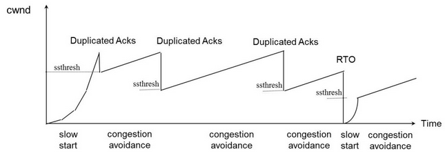
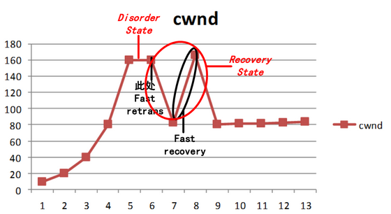

## [原文](http://www.fanyilun.me/2015/12/16/%E5%85%B3%E4%BA%8ETCP%E6%BB%91%E5%8A%A8%E7%AA%97%E5%8F%A3%E5%92%8C%E6%8B%A5%E5%A1%9E%E6%8E%A7%E5%88%B6/)

# 拥塞窗口

- 拥塞窗口（Congestion Window简称cwnd）：指某一源端数据流在一个RTT内可以最多发送的数据包数。

- 拥塞控制主要是四个算法：1）慢启动，2）拥塞避免，3）拥塞发生，4）快速恢复

- TCP的核心是拥塞控制，目的是探测网络速度，保证传输顺畅

## 慢启动：

  - 初始化cwnd = 1，表明可以传一个MSS大小的数据（Linux默认2/3/4，google实验10最佳，国内7最佳）
  
  - 每当收到一个ACK，cwnd++; 呈线性上升
  
  - 因此，每个RTT(Round Trip Time，一个数据包从发出去到回来的时间)时间内发送的数据包数量翻倍，
  导致了每当过了一个RTT，cwnd = cwnd*2; 呈指数让升
  
  - ssthresh（slow start threshold：缓慢启动阈值）是上限，当cwnd >= ssthresh时，就会进入“拥塞避免算法”

## 拥塞避免算法：（当cwnd达到ssthresh时后，一般来说是65535byte）
  
  - 收到一个ACK时，cwnd = cwnd + 1/cwnd
  
  - 当每过一个RTT时，cwnd = cwnd + 1

## 拥塞发生时：

1. 表现为RTO（Retransmission TimeOut）超时，重传数据包（反应比较强烈）
   - sshthresh =  cwnd /2
   - cwnd 重置为 1，进入慢启动过程
2. 收到第3个duplicate ACK时（从收到第一个重复ACK起，到收到第三个重复ACK止，窗口不做调整，即fast restransmit）
   - cwnd = cwnd /2
   - sshthresh = cwnd

## 进入快速恢复算法——Fast Recovery

  - 快速恢复算法（执行完上述两个步骤之后）：
  - cwnd = sshthresh  + 3 (MSS)
  - 重传Duplicated ACKs指定的数据包
  - 之后每收到一个duplicated Ack，cwnd = cwnd +1 （此时增窗速度很快）
  - 如果收到了新的Ack，那么，cwnd = sshthresh ，然后就进入了拥塞避免的算法
  
  
