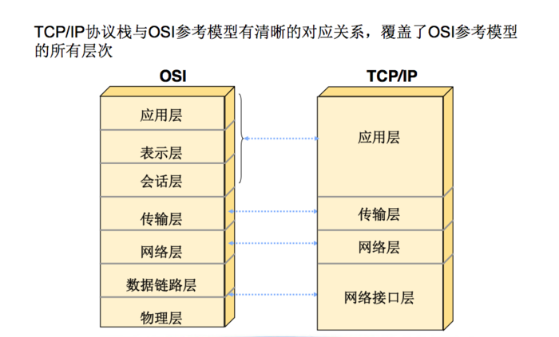

## [原文](https://www.cnblogs.com/mrsandstorm/p/5701691.html)

# TCP 传输工作原理

## 引言

在TCP/IP体系结构中，IP协议只管将数据包尽力传送到目的主机，
无论数据传输正确与否，它都不做验证，不发确认，也不保证数据包的顺序，因而不具有可靠性。
这一问题要由传输层TCP协议来解决，TCP协议为Internet提供了可靠的无差错的通信服务。

## TCP协议简介
TCP是专门用于在不可靠的因特网上提供可靠的、端对端的字节流通信的协议。
通过在发送方和接收方分别创建一个称为套接字的通信端口就可以获得TCP服务。

TCP协议是一个可靠的面向连接的传输层协议，
它将某结点的数据以字节流的形式无差错地传送到互联网的任何一台机器上。
发送方的TCP将用户递交的字节流划分成独立的报文进行发送，而接收方的TCP将接收的报文重新装配上交给接收用户。
TCP同时处理有关流量控制的问题，以防止快速的发送方“淹没”慢速的接收方。
一旦数据报被破坏或丢失，通常是TCP将其重新传输，而不是应用程序或IP协议。

## OSI参考模型和TCP/IP参考模型

OSI模型（open system interconnection reference model）是基于国际标准化组织（ISO）的建议而发展起来的，它分为如图1所示的七层。

TCP/IP最初是为ARPANET网开发的网络体系结构，主要由两个重要协议即TCP协议和IP协议而得名。

虽然TCP/IP不是ISO倡导的标准，但它有广泛的商业应用，因此TCP/IP是一种事实上的标准。
由于Internet已经得到了全世界的承认，
因而Internet所使用的TCP/IP体系在计算机网络领域中就占有特殊重要的地位。

## TCP数据报的传输

### 1．TCP数据报报头

发送和接收方TCP实体以数据报的形式交换数据。
一个数据报包含一个固定的20字节的头、一个可选部分以及0或多字节的数据。
TCP必须与低层的IP（使用IP定义好的方法）和高层的应用程序（使用TCP-ULP元语）进行通信。
TCP还必须通过网络与其他TCP软件进行通信。
图给出了TCP数据报头的格式：

TCP数据报头结构

- 源端口、目的端口：16位长。标识出远端和本地的端口号。
- 顺序号：32位长。表明了发送的数据报的顺序。
- 确认号：32位长。希望收到的下一个数据报的序列号。
- TCP头长：4位长。表明TCP头中包含多少个32位字。
接下来的6位未用。
- URG：报文携带了紧急数据，urgent offset有效。
- ACK：ACK位置1表明确认号是合法的。如果ACK为0，那么数据报不包含确认信息，确认字段被省略。
- PSH：表示是带有PUSH标志的数据。接收方因此请求数据报一到便可送往应用程序而不必等到缓冲区装满时才传送。
- RST：用于复位由于主机崩溃或其它原因而出现的错误的连接。还可以用于拒绝非法的数据报或拒绝连接请求。
- SYN：用于建立连接。
- FIN：用于释放连接。
- 窗口大小：16位长。窗口大小字段表示在确认了字节之后还可以发送多少个字节。
- 校验和：16位长。是为了确保高可靠性而设置的。它校验头部、数据和伪TCP头部之和。
- 可选项：0个或多个32位字。包括最大TCP载荷，窗口比例、选择重发数据报等选项。

### 2．可靠传输

当TCP发出一个分组后，它启动一个超时计时器，
如果在超时计时器到期之前收到了对方的确认，就撤销已设置的超时计时器。

如果不能及时收到一个确认，就认为刚才发送的分组丢失了，将重发这个分组，这就叫超时重传。

TCP中保持可靠性的方式就是确认和重传机制，这样就可以在不可靠的传输网络上实现可靠的通信。

### 3．传输策略

如果发送方把数据发送得过快，接收方可能会来不及接收，这就会造成数据的丢失。

所谓流量控制就是让发送方的发送速率不要太快，要让接收方来得及接收。

利用滑动窗口机制可以很方便地在TCP连接上实现对发送方的流量控制。

TCP中采用滑动窗口来进行传输控制，滑动窗口的大小意味着接收方还有多大的缓冲区可以用于接收数据。

发送方可以通过滑动窗口的大小来确定应该发送多少字节的数据。
当滑动窗口为0时，发送方一般不能再发送数据报。

但有两种情况除外，一种情况是可以发送紧急数据，例如，允许用户终止在远端机上的运行进程。
另一种情况是发送方可以发送一个1字节的数据报来通知接收方重新声明它希望接收的下一字节及发送方的滑动窗口大小。

### 4．拥塞控制

拥塞控制：防止过多的数据注入到网络中，这样可以使网络中的路由器或链路不致过载。

拥塞控制方法：慢开始( slow-start )、拥塞避免( congestion avoidance )、快重传( fast retransmit )和快恢复( fast recovery )。

发送方维持一个拥塞窗口 cwnd ( congestion window )的状态变量。
拥塞窗口的大小取决于网络的拥塞程度，并且动态地在变化。
发送方让自己的发送窗口等于拥塞窗口。

慢开始算法：当主机开始发送数据时，因为现在并不清楚网络的负荷情况。
因此，较好的方法是先探测一下，即由小到大逐渐增大发送窗口，也就是说，由小到大逐渐增大拥塞窗口数值。

通常在刚刚开始发送报文段时，先把拥塞窗口 cwnd 设置为一个最大报文段MSS的数值。
每经过一个传输轮次，拥塞窗口 cwnd 就加倍。
慢开始的“慢”并不是指cwnd的增长速率慢，而是指在TCP开始发送报文段时先设置cwnd=1，
使得发送方在开始时只发送一个报文段（目的是试探一下网络的拥塞情况），然后再逐渐增大cwnd。

为了防止拥塞窗口cwnd增长过大引起网络拥塞，还需要设置一个慢开始门限ssthresh状态变量（如何设置ssthresh）。
慢开始门限ssthresh的用法如下：

- 当 cwnd < ssthresh 时，使用上述的慢开始算法。
- 当 cwnd > ssthresh 时，停止使用慢开始算法而改用拥塞避免算法。
- 当 cwnd = ssthresh 时，既可使用慢开始算法，也可使用拥塞控制避免算法。

拥塞避免算法：让拥塞窗口cwnd缓慢地增大，即每经过一个往返时间RTT就把发送方的拥塞窗口cwnd加1，而不是加倍。
这样拥塞窗口cwnd按线性规律缓慢增长，比慢开始算法的拥塞窗口增长速率缓慢得多。

无论在慢开始阶段还是在拥塞避免阶段，只要发送方判断网络出现拥塞（其根据就是没有收到确认），
就要把慢开始门限ssthresh设置为出现拥塞时的发送方窗口值的一半（但不能小于2）。
然后把拥塞窗口cwnd重新设置为1，执行慢开始算法。
这样做的目的就是要迅速减少主机发送到网络中的分组数，使得发生拥塞的路由器有足够时间把队列中积压的分组处理完毕。

如下图，用具体数值说明了上述拥塞控制的过程。现在发送窗口的大小和拥塞窗口一样大。

