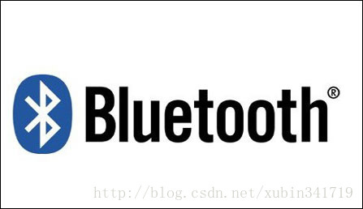

## [原文](https://blog.csdn.net/xubin341719/article/details/38145507)

# 名称由来及其发展历史

蓝牙核心技术概述（一）：蓝牙概述

蓝牙核心技术概述（二）：蓝牙使用场景

蓝牙核心技术概述（三）： 蓝牙协议规范（射频、基带链路控制、链路管理）

蓝牙核心技术概述（四）：蓝牙协议规范（HCI、L2CAP、SDP、RFOCMM）

蓝牙核心技术概述（五）：蓝牙协议规范（irOBEX、BNEP、AVDTP、AVCTP）
 
[详见原文](https://blog.csdn.net/xubin341719/article/details/38303881)

## 名字由来

蓝牙这个名称来自于第十世纪的一位丹麦国王哈拉尔蓝牙王，
哈拉尔蓝牙王Blatand 在英文里的意思可以被解释为 Bluetooth( 蓝牙 )因为国王喜欢吃蓝莓，
牙龈每天都是蓝色的所以叫蓝牙。

在行业协会筹备阶段，需要一个极具有表现力的名字来命名这项高新技术。行业组织人员，
在经过一夜关于欧洲历史和未来无线技术发展的讨论后，有些人认为用Blatand国王的名字命名再合适不过了。
Blatand国王将挪威，瑞典和丹麦统一起来；
他的口齿伶俐,善于交际,就如同这项即将面世的技术，技术将被定义为允许不同工业领域之间的协调工作，
保持着各个系统领域之间的良好交流，例如计算机，手机和汽车行业之间的工作。
 
 
 
## 发展历史

- 1994年爱立信公司研发；

- 1997年爱立信联系其他设备生产商；

- 1998年二月，诺基亚、苹果、三星组成的一个特殊兴趣小组SIG(Special Interest Group)；

- 1998年5月，爱立信、诺基亚、东芝、IBM和英特尔公司等五家著名厂商，联合开发；

- 1999年下半年，微软、摩托罗拉、三星、朗讯等主流设备商广泛推广蓝牙技术应用；

- 2006年10月13日，Bluetooth SIG（蓝牙技术联盟）发展到200多家联盟成员公司以及约6000家应用成员企业。

 
 